# Ngerti.in User Flow Specification

## 1. Document Purpose

This document defines the primary user flows for Ngerti.in v1.

The flows are aligned with the Product Requirement Document and Database ERD Specification.

---

# 2. Authentication Flow

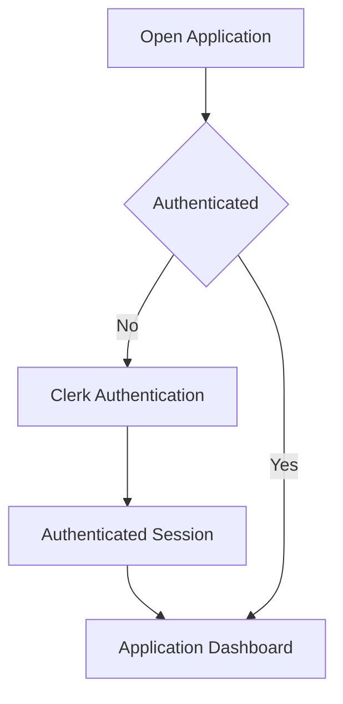

### Expected Behavior

- Clerk is the authentication provider.
- The application maintains a local `users` record associated with `clerk_user_id`.
- Application data is loaded only after authentication is established.

---

# 3. Dashboard Flow

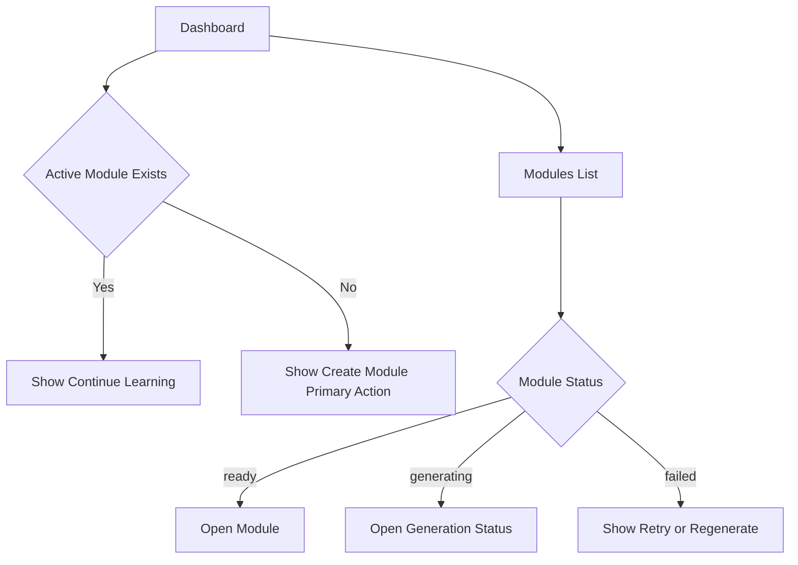

### Dashboard Priorities

1. Continue current learning.
2. View existing modules.
3. Create a new module.

The dashboard is not a social feed or public content discovery surface in v1.

---

# 4. Create Module Flow

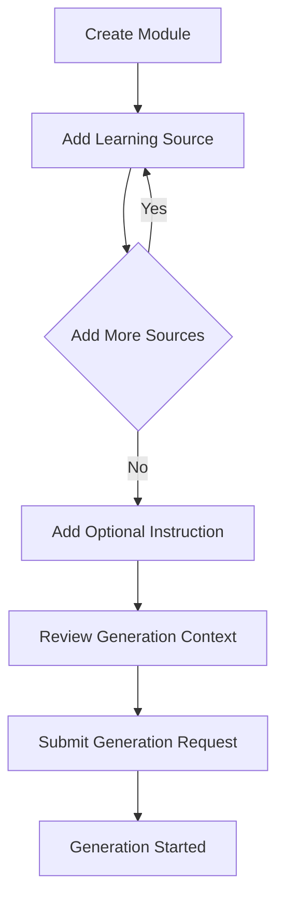

Supported source types:

```text
PDF
URL
Text
```

Example:

```text
PDF:
Biology Grade 11.pdf

URL:
https://example.com/digestion

Instruction:
Focus on pages 45-62 of the PDF. Use the URL only as supporting material.
```

---

# 5. Source Upload Flow

## 5.1 PDF

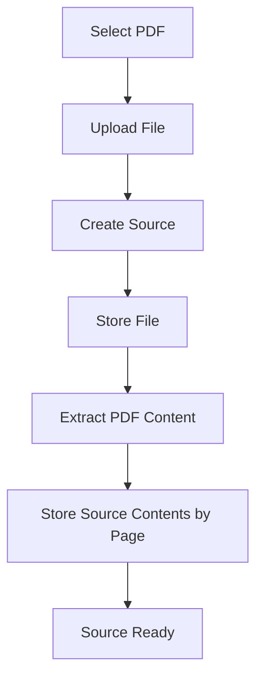

The file itself is stored in S3-compatible object storage.

The database stores source metadata and extracted content.

---

## 5.2 URL

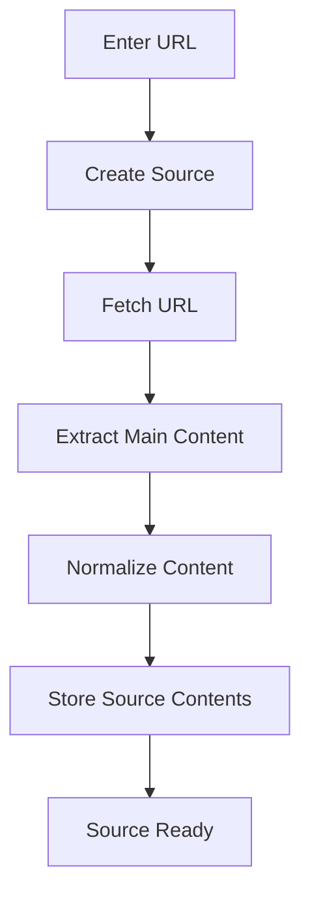

---

## 5.3 Text

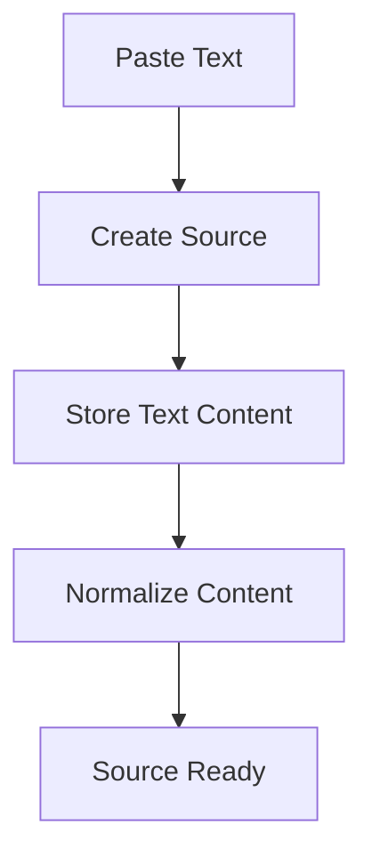

---

# 6. Generation Request Flow

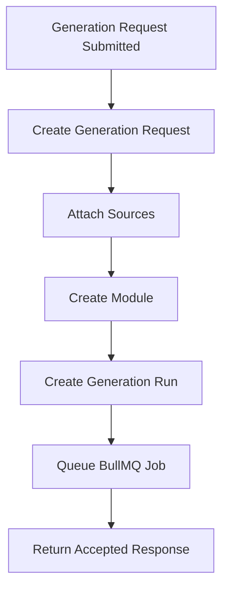

The HTTP request must not wait for full module generation.

---

# 7. Module Generation Status Flow

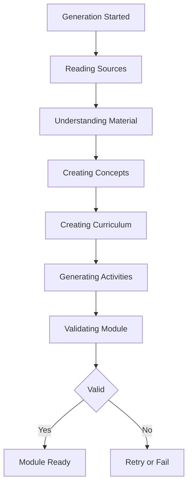

The frontend receives generation state through SSE or status polling.

---

# 8. Start Learning Flow

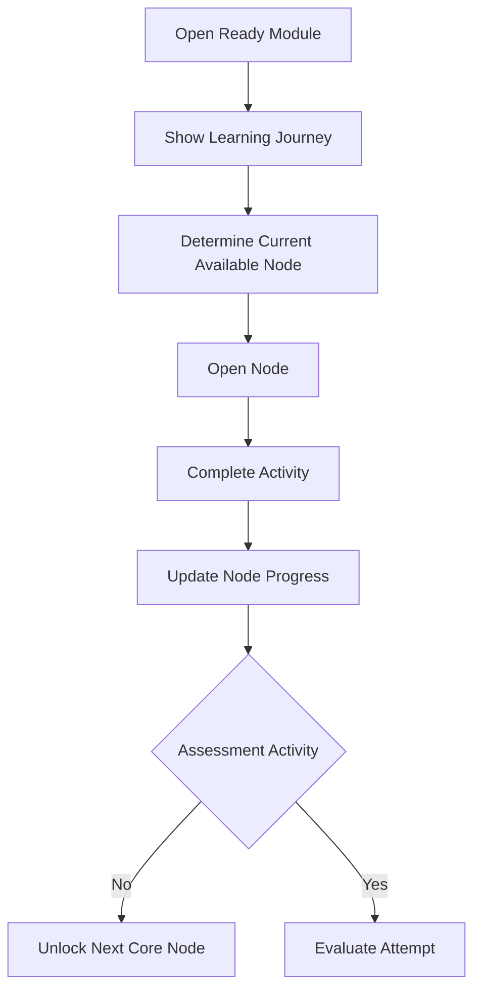

---

# 9. Lesson Flow

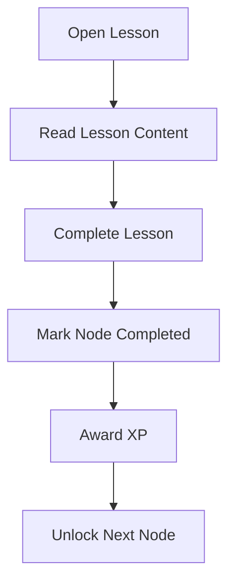

---

# 10. Flashcard Flow

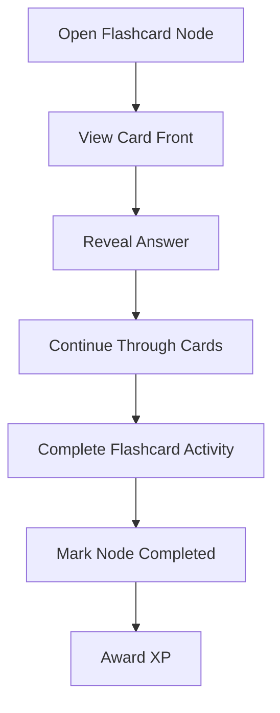

Flashcards in v1 do not require a full spaced repetition scheduler.

---

# 11. Quiz Flow

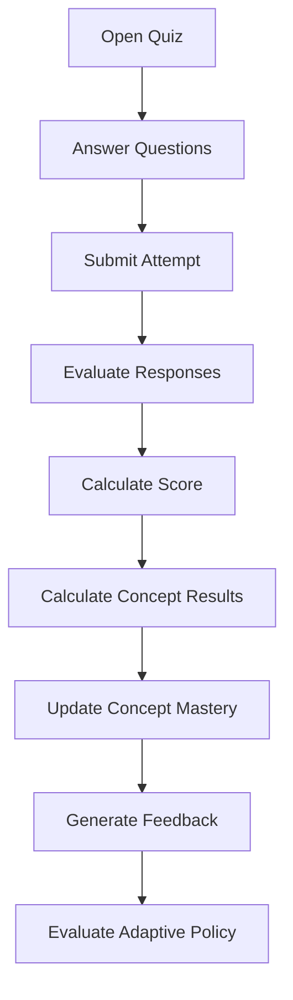

---

# 12. Adaptive Decision Flow

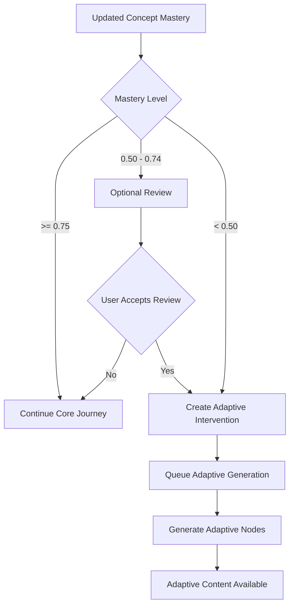

---

# 13. Adaptive Learning Flow

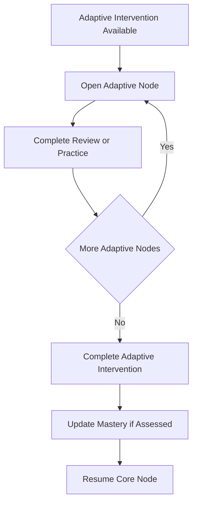

Adaptive content is supplemental to the original core curriculum.

---

# 14. Failed Generation Flow

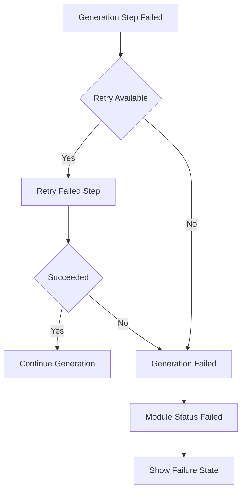

The failure state must not silently disappear.

The user should be able to retry or regenerate when supported.

---

# 15. Resume Learning Flow

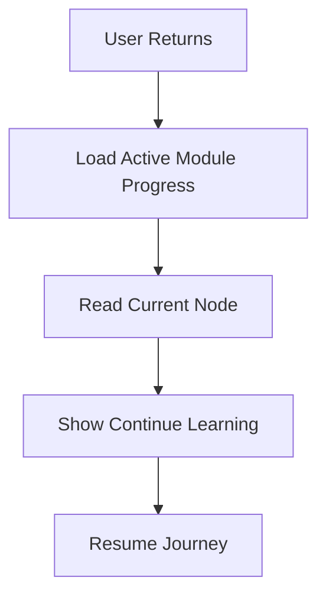

The learner must not manually determine where they stopped.

---

# 16. Core Journey Rules

The user journey follows the ordered core nodes generated for the module.

Example:

```text
Core 1
↓
Core 2
↓
Core 3
↓
Core 4
↓
Checkpoint
```

Adaptive branches may be inserted between core nodes for individual users.

Example:

```text
Core 1
↓
Core 2
↓
Core 3
↓
Adaptive Review
↓
Adaptive Practice
↓
Core 4
```

The underlying core sequence remains unchanged.

---

# 17. Main Application Screens

```text
/sign-in
/dashboard
/modules/new
/modules/:moduleId/generation
/modules/:moduleId
/modules/:moduleId/learn/:nodeId
/profile
```

Exact route naming may change during implementation, but the responsibilities should remain equivalent.

---

# 18. Navigation Principles

- The application should always make the next learning action clear.
- Users should not need to understand concepts such as generation runs, source extraction, or mastery calculation.
- Technical generation state should be translated into concise user-facing progress states.
- Adaptive content should appear as part of the learning journey, not as a separate administrative feature.
