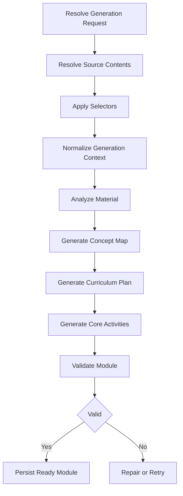
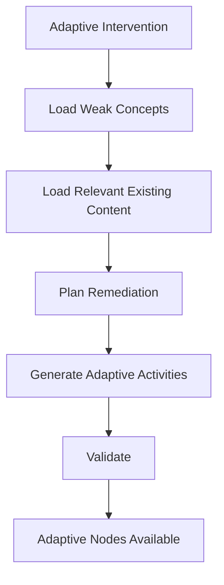

# Ngerti.in AI Generation Specification

## 1. Document Purpose

This document defines the AI-assisted generation architecture for Ngerti.in v1.

The AI layer is responsible for transforming normalized learning context into structured educational content.

The AI layer does not control application state, authorization, progress rules, or adaptive thresholds.

---

# 2. AI Architecture Principles

1. AI output must be structured.
2. AI output must be schema validated.
3. AI calls should be split into meaningful stages.
4. Long-running generation must execute in background workers.
5. Generation steps must be retryable.
6. AI output must be validated before becoming user-visible.
7. The core curriculum must be generated separately from adaptive content.
8. Adaptive content must be generated on demand.
9. Provider-specific code should be isolated behind an AI model abstraction.
10. AI framework choice must not determine core domain design.

---

# 3. Recommended AI Stack

Baseline:

```text
AI SDK Core
Zod
Provider SDKs
NestJS Services
BullMQ Worker
```

Optional future additions:

```text
LangGraph
LangChain document integrations
Dedicated retrieval layer
Embedding pipeline
```

LangGraph should only be introduced when generation requires persistent branching, loops, human intervention, or complex stateful orchestration.

---

# 4. Generation Inputs

A module generation receives:

```text
Generation Request
├── Instruction
└── Sources
    ├── Primary
    ├── Reference
    └── Supplementary
```

Each source must already be normalized before curriculum generation.

Input context should preserve:

- Source identity
- Source role
- Source priority
- Source selectors
- Page or section boundaries when available

---

# 5. Module Generation Pipeline



---

# 6. Step 1: Resolve Generation Context

The worker loads:

- Generation request
- Instruction
- Referenced sources
- Extracted source contents
- Source roles
- Source priorities
- Selectors

The worker must not send irrelevant source content to the model.

Example selector:

```json
{
  "pages": {
    "from": 45,
    "to": 62
  }
}
```

Only the selected PDF content should be included when possible.

---

# 7. Step 2: Material Analysis

Purpose:

Understand the material before generating the learning journey.

Recommended output:

```ts
type MaterialAnalysis = {
  subject: string;
  level?: string;
  summary: string;
  estimatedComplexity: "low" | "medium" | "high";
  keyTopics: Array<{
    key: string;
    title: string;
    description: string;
    importance: number;
  }>;
  constraints: string[];
};
```

The result must be validated using Zod.

---

# 8. Step 3: Concept Map Generation

Purpose:

Convert material analysis into explicit learning concepts.

Recommended output:

```ts
type ConceptMap = {
  concepts: Array<{
    key: string;
    name: string;
    description?: string;
    importance: number;
    prerequisites: string[];
  }>;
};
```

Concept keys must be stable within the generation run.

The generated concept map becomes `module_concepts`.

---

# 9. Step 4: Curriculum Planning

Purpose:

Create the ordered core learning journey.

Recommended output:

```ts
type CurriculumPlan = {
  title: string;
  description?: string;
  difficulty: "beginner" | "intermediate" | "advanced";
  estimatedMinutes?: number;

  nodes: Array<{
    key: string;
    type: "lesson" | "flashcard" | "quiz" | "checkpoint";
    title: string;
    description?: string;
    concepts: Array<{
      conceptKey: string;
      relation: "teach" | "review" | "assess";
      weight: number;
    }>;
  }>;
};
```

The curriculum planner determines:

- Number of nodes
- Node order
- Node type
- Concept coverage
- Assessment placement

The number of nodes must not be hard-coded globally.

---

# 10. Step 5: Activity Generation

Each planned node is converted into one or more concrete activities.

Activity generation should occur per node or in small batches.

This allows independent retries.

---

# 11. Lesson Generation

Recommended output:

```ts
type LessonActivity = {
  type: "lesson";
  content: {
    introduction?: string;
    explanation: string;
    keyPoints: string[];
    examples?: string[];
    summary?: string;
  };
};
```

The lesson should be concise and appropriate to the generated difficulty.

---

# 12. Flashcard Generation

Recommended output:

```ts
type FlashcardActivity = {
  type: "flashcard";
  content: {
    cards: Array<{
      front: string;
      back: string;
      conceptKey: string;
    }>;
  };
};
```

Flashcards should target recall-worthy concepts.

---

# 13. Multiple Choice Generation

Recommended output:

```ts
type MultipleChoiceActivity = {
  type: "multiple_choice";

  content: {
    question: string;
    options: string[];
  };

  evaluationConfig: {
    correctAnswer: number;
    explanation: string;
    conceptWeights: Array<{
      conceptKey: string;
      weight: number;
    }>;
  };
};
```

The correct answer must never be exposed through the client activity payload before evaluation.

---

# 14. True or False Generation

Recommended output:

```ts
type TrueFalseActivity = {
  type: "true_false";

  content: {
    statement: string;
  };

  evaluationConfig: {
    correctAnswer: boolean;
    explanation: string;
    conceptWeights: Array<{
      conceptKey: string;
      weight: number;
    }>;
  };
};
```

---

# 15. Short Answer Generation

Recommended output:

```ts
type ShortAnswerActivity = {
  type: "short_answer";

  content: {
    prompt: string;
  };

  evaluationConfig: {
    expectedConcepts: string[];
    rubric: Array<{
      criterion: string;
      weight: number;
    }>;
  };
};
```

Short-answer evaluation may use AI-assisted grading, but the result must remain structured.

---

# 16. Module Validation

Before a module becomes `ready`, the validation stage should verify:

- Required fields exist.
- Concept references are valid.
- Node ordering is valid.
- Assessment nodes evaluate existing concepts.
- Activity schemas are valid.
- No unsupported activity type exists.
- Core nodes contain no adaptive references.
- Evaluation configuration is present where required.
- Generated content is non-empty.
- Duplicate or near-duplicate nodes are minimized.
- Instruction constraints are respected.

Validation should include deterministic checks before optional AI quality review.

---

# 17. Adaptive Generation Trigger

Adaptive generation is not part of initial module generation.

Adaptive generation begins only after:

```text
Attempt
↓
Concept Result
↓
Mastery Update
↓
Adaptive Policy
↓
Adaptive Intervention Created
```

The adaptive worker receives:

- Module context
- Trigger node
- Trigger attempt
- Weak concepts
- Current mastery values
- Relevant existing module content
- Resume node

---

# 18. Adaptive Generation Pipeline



---

# 19. Adaptive Planning

Recommended output:

```ts
type AdaptivePlan = {
  reasonSummary: string;

  nodes: Array<{
    type: "review" | "practice" | "flashcard" | "remedial_quiz";
    title: string;
    targetConceptKeys: string[];
  }>;
};
```

The adaptive plan must remain narrow.

It should target the identified weakness rather than regenerate a large portion of the module.

---

# 20. Adaptive Content Rules

Adaptive content should:

- Focus on weak concepts.
- Avoid repeating unrelated material.
- Use existing module terminology.
- Avoid contradicting core material.
- Be short enough to function as remediation.
- Include reassessment when appropriate.

Adaptive content must not modify existing core nodes.

---

# 21. AI Feedback Generation

Feedback input should include:

- Assessment result
- Concept-level performance
- Incorrect responses
- Correct responses where useful
- Current mastery state

Recommended output:

```ts
type AssessmentFeedback = {
  summary: string;
  strengths: string[];
  areasToImprove: string[];
};
```

Feedback should not contain internal mastery thresholds or implementation details.

---

# 22. Model Strategy

The system should support different models for different tasks.

Example strategy:

```text
Material analysis
Balanced model

Concept map
Balanced model

Curriculum planning
Higher reasoning model

Flashcards
Lower-cost model

Basic quizzes
Lower-cost model

Validation
Lower-cost structured model or deterministic rules

Short-answer grading
Balanced model
```

The exact provider and model names must remain configurable.

---

# 23. Provider Abstraction

Application services should reference model capabilities rather than hard-coded provider names.

Example:

```ts
interface AiModelRegistry {
  analysisModel: LanguageModel;
  curriculumModel: LanguageModel;
  activityModel: LanguageModel;
  evaluationModel: LanguageModel;
}
```

This allows providers to change without changing domain logic.

---

# 24. Retry Strategy

Recommended retry layers:

```text
BullMQ
Controls job and step retries.

AI client
May retry transient provider failures in a limited manner.

Application validation
May request a targeted repair when structured output is invalid.
```

Retries must not be duplicated excessively across layers.

Avoid a configuration where:

```text
BullMQ retry
× AI SDK retry
× provider retry
× graph retry
```

causes uncontrolled request multiplication.

---

# 25. Idempotency

Each generation run must be safe to retry.

Recommended requirements:

- Generation run ID is stable.
- Node generation can detect previously persisted output.
- A retried step does not duplicate activities.
- Finalization occurs in a transaction when appropriate.
- Generation status transitions are deterministic.

---

# 26. Timeout Policy

Each AI operation should have an explicit timeout appropriate to its workload.

A single module generation should not be implemented as one large model call.

Long generation should be decomposed into smaller operations.

---

# 27. Observability

Recommended tracked data:

- Generation run ID
- Generation step
- Model
- Provider
- Latency
- Input token estimate
- Output token usage
- Retry count
- Validation status
- Error category

A dedicated LLM observability product such as Langfuse may be added after the initial generation pipeline is stable.

---

# 28. Future LangGraph Adoption Criteria

LangGraph should be considered when one or more of the following become necessary:

- Persistent branching workflows
- Iterative self-correction loops
- Human approval during generation
- Long-lived AI state
- Multiple AI tools with dynamic routing
- Complex graph execution
- Resume from AI-level checkpoints
- Multi-agent orchestration

Until then, NestJS services plus BullMQ provide sufficient orchestration.

---

# 29. AI Safety and Quality Boundary

Generated content must be treated as untrusted output until validated.

The application must not directly persist arbitrary model output without:

1. Schema validation.
2. Referential validation.
3. Domain validation.
4. Sanitization where required.
5. Content policy checks where applicable.

---

# 30. AI Module Boundaries

Recommended package structure:

```text
packages/ai
├── models
│   └── model-registry.ts
│
├── analysis
│   ├── material-analysis.service.ts
│   └── material-analysis.schema.ts
│
├── concepts
│   ├── concept-generator.service.ts
│   └── concept.schema.ts
│
├── curriculum
│   ├── curriculum.service.ts
│   └── curriculum.schema.ts
│
├── activities
│   ├── lesson.generator.ts
│   ├── flashcard.generator.ts
│   ├── quiz.generator.ts
│   └── activity.schemas.ts
│
├── adaptive
│   ├── adaptive-planner.service.ts
│   ├── adaptive-generator.service.ts
│   └── adaptive.schemas.ts
│
└── evaluation
    ├── feedback.service.ts
    └── evaluation.schemas.ts
```
