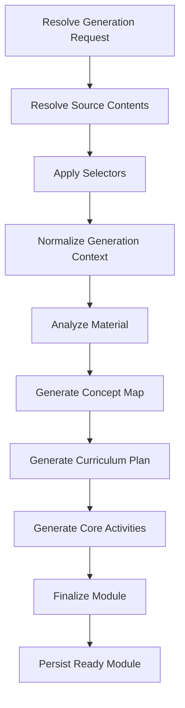
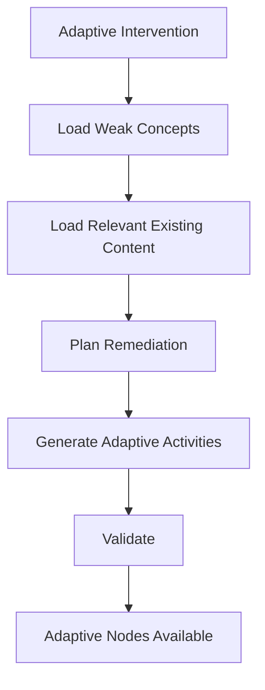

# Ngerti.in AI Generation Specification

## 1. Document Purpose

This document defines the AI-assisted generation architecture for Ngerti.in v1.

The AI layer is responsible for transforming normalized learning context into structured educational content.

The AI layer does not control application state, authorization, progress rules, or adaptive thresholds.

---

# 2. AI Architecture Principles

1. AI output must be structured.
2. AI output must be schema validated once at the model boundary.
3. AI calls should be split into meaningful stages.
4. Long-running generation must execute in background workers.
5. Generation steps must be retryable.
6. Final persistence must enforce aggregate and database invariants.
7. The core curriculum must be generated separately from adaptive content.
8. Adaptive content must be generated on demand.
9. Provider-specific code should be isolated behind an AI model abstraction.
10. AI framework choice must not determine core domain design.

---

# 3. Recommended AI Stack

Baseline:

```text
LangChain Core
LangChain OpenAI integration
Zod
NestJS Services
BullMQ Worker
LangGraph open-source library
LangGraph PostgreSQL checkpointer
```

Optional future additions:

```text
Additional LangChain document integrations
Dedicated retrieval layer
Embedding pipeline
```

LangGraph is used as an in-process worker library for the module-generation graph and durable intermediate checkpoints. LangGraph Server, LangGraph CLI deployment, and LangSmith deployment are not required.

BullMQ remains the durable job-delivery boundary. PostgreSQL application tables remain authoritative for public status and finalized learning content.

---

# 4. Generation Inputs

A module generation receives:

```text
Generation Request
├── Instruction
└── Sources
    ├── Primary
    ├── Reference
    └── Supplementary
```

Each source must already be normalized before curriculum generation.

Input context should preserve:

- Source identity
- Source role
- Source priority
- Source selectors
- Page or section boundaries when available

---

# 5. Module Generation Pipeline



---

# 6. Step 1: Resolve Generation Context

The worker loads:

- Generation request
- Instruction
- Referenced sources
- Extracted source contents
- Source roles
- Source priorities
- Selectors

The worker must not send irrelevant source content to the model.

Example selector:

```json
{
  "pages": {
    "from": 45,
    "to": 62
  }
}
```

Only the selected PDF content should be included when possible.

---

# 7. Step 2: Material Analysis

Purpose:

Understand the material before generating the learning journey.

Recommended output:

```ts
type MaterialAnalysis = {
  subject: string;
  level: string | null;
  summary: string;
  estimatedComplexity: "low" | "medium" | "high";
  keyTopics: Array<{
    key: string;
    title: string;
    description: string;
    importance: number;
  }>;
  constraints: string[];
};
```

The result is parsed once through LangChain `withStructuredOutput()` using its Zod schema.

---

# 8. Step 3: Concept Map Generation

Purpose:

Convert material analysis into explicit learning concepts.

Recommended output:

```ts
type ConceptMap = {
  concepts: Array<{
    key: string;
    name: string;
    description: string | null;
    importance: number;
    prerequisites: string[];
  }>;
};
```

Concept keys must be stable within the generation run.

The generated concept map becomes `module_concepts`.

---

# 9. Step 4: Curriculum Planning

Purpose:

Create the ordered core learning journey.

Recommended output:

```ts
type CurriculumPlan = {
  title: string;
  description: string | null;
  difficulty: "beginner" | "intermediate" | "advanced";
  estimatedMinutes: number | null;

  nodes: Array<{
    key: string;
    type: "lesson" | "flashcard" | "quiz" | "checkpoint";
    title: string;
    description: string | null;
    concepts: Array<{
      conceptKey: string;
      relation: "teach" | "review" | "assess";
      weight: number;
    }>;
  }>;
};
```

The curriculum planner determines:

- Number of nodes
- Node order
- Node type
- Concept coverage
- Assessment placement

The number of nodes must not be hard-coded globally.

---

# 10. Step 5: Activity Generation

Each planned node is converted into one or more concrete activities.

Activity generation should occur per node or in small batches.

This allows independent retries.

---

# 11. Lesson Generation

Recommended output:

```ts
type LessonActivity = {
  type: "lesson";
  content: {
    introduction: string | null;
    explanation: string;
    keyPoints: string[];
    examples: string[] | null;
    summary: string | null;
  };
};
```

The lesson should be concise and appropriate to the generated difficulty.

---

# 12. Flashcard Generation

Recommended output:

```ts
type FlashcardActivity = {
  type: "flashcard";
  content: {
    cards: Array<{
      front: string;
      back: string;
      conceptKey: string;
    }>;
  };
};
```

Flashcards should target recall-worthy concepts.

---

# 13. Multiple Choice Generation

Recommended output:

```ts
type MultipleChoiceActivity = {
  type: "multiple_choice";

  content: {
    question: string;
    options: string[];
  };

  evaluationConfig: {
    correctAnswer: number;
    explanation: string;
    conceptWeights: Array<{
      conceptKey: string;
      weight: number;
    }>;
  };
};
```

The correct answer must never be exposed through the client activity payload before evaluation.

---

# 14. True or False Generation

Recommended output:

```ts
type TrueFalseActivity = {
  type: "true_false";

  content: {
    statement: string;
  };

  evaluationConfig: {
    correctAnswer: boolean;
    explanation: string;
    conceptWeights: Array<{
      conceptKey: string;
      weight: number;
    }>;
  };
};
```

---

# 15. Short Answer Generation

Recommended output:

```ts
type ShortAnswerActivity = {
  type: "short_answer";

  content: {
    prompt: string;
  };

  evaluationConfig: {
    expectedConcepts: string[];
    rubric: Array<{
      criterion: string;
      weight: number;
    }>;
  };
};
```

Short-answer evaluation may use AI-assisted grading, but the result must remain structured.

---

# 16. Module Finalization

Each model response is parsed once by LangChain `withStructuredOutput()` with the Zod schema for
that generation step. Application code must not parse the same response again.

Before a Module becomes `ready`, finalization only enforces invariants that span multiple structured
outputs or belong to persistence, such as complete activity generation and relational constraints.
The final Module, Concepts, Nodes, Activities, owner progress, and generation status are persisted in
one database transaction.

An optional AI quality review may be added later, but must be a deliberate generation step rather
than a second deterministic parser for an already structured response.

---

# 17. Adaptive Generation Trigger

Adaptive generation is not part of initial module generation.

Adaptive generation begins only after:

```text
Attempt
↓
Concept Result
↓
Mastery Update
↓
Adaptive Policy
↓
Adaptive Intervention Created
```

The adaptive worker receives:

- Module context
- Trigger node
- Trigger attempt
- Weak concepts
- Current mastery values
- Relevant existing module content
- Resume node

---

# 18. Adaptive Generation Pipeline



---

# 19. Adaptive Planning

Recommended output:

```ts
type AdaptivePlan = {
  reasonSummary: string;

  nodes: Array<{
    type: "review" | "practice" | "flashcard" | "remedial_quiz";
    title: string;
    targetConceptKeys: string[];
  }>;
};
```

The adaptive plan must remain narrow.

It should target the identified weakness rather than regenerate a large portion of the module.

---

# 20. Adaptive Content Rules

Adaptive content should:

- Focus on weak concepts.
- Avoid repeating unrelated material.
- Use existing module terminology.
- Avoid contradicting core material.
- Be short enough to function as remediation.
- Include reassessment when appropriate.

Adaptive content must not modify existing core nodes.

---

# 21. AI Feedback Generation

Feedback input should include:

- Assessment result
- Concept-level performance
- Incorrect responses
- Correct responses where useful
- Current mastery state

Recommended output:

```ts
type AssessmentFeedback = {
  summary: string;
  strengths: string[];
  areasToImprove: string[];
};
```

Feedback should not contain internal mastery thresholds or implementation details.

---

# 22. Model Strategy

The system should support different models for different tasks.

Example strategy:

```text
Material analysis
Balanced model

Concept map
Balanced model

Curriculum planning
Higher reasoning model

Flashcards
Lower-cost model

Basic quizzes
Lower-cost model

Validation
Lower-cost structured model or deterministic rules

Short-answer grading
Balanced model
```

The exact provider and model names must remain configurable.

---

# 23. Provider Abstraction

`AiModule` constructs the configured LangChain chat model through `createModel(environment)` and
exposes only the reusable `AiService`. Callers submit a schema, schema name, operation, and prompt;
they do not construct provider clients or call `withStructuredOutput()` directly.

Example:

```ts
interface AiModel {
  client: BaseChatModel;
  provider: string;
  modelId: string;
}

interface GenerateObjectRequest<T> {
  schema: ZodType<T>;
  schemaName: string;
  operation: string;
  prompt: string;
}

const result = await aiService.generateObject(request);
```

`AiService.generateObject()` owns strict structured-output parsing, one bounded invalid-output retry,
model-call logging, latency tracking, and reusable AI error classification. Module-specific schemas
and pure prompt builders remain in `apps/worker/src/modules`, so the AI module does not depend on
source types, job contracts, or public generation failures. Provider-facing object properties are
required; semantically optional values use explicit `null`. This allows providers to change without
changing module-generation logic.

---

# 24. Retry Strategy

Recommended retry layers:

```text
BullMQ
Retries worker crashes and infrastructure failures.

LangChain model client
Performs a small bounded retry for provider timeouts and rate limits.

LangGraph
Sequences and checkpoints generation steps without adding another retry layer.

Structured output
Retries one invalid model output, then fails the generation step when the second response still does
not match its Zod schema.
```

Retries must not be duplicated excessively across layers.

Avoid a configuration where:

```text
BullMQ retry
× LangChain retry
× provider SDK retry
× LangGraph retry
```

causes uncontrolled request multiplication.

---

# 25. Idempotency

Each generation run must be safe to retry.

Recommended requirements:

- Generation run ID is stable.
- Node generation can detect previously persisted output.
- A retried step does not duplicate activities.
- Finalization occurs in a transaction when appropriate.
- Generation status transitions are deterministic.

---

# 26. Timeout Policy

Each AI operation should have an explicit timeout appropriate to its workload.

A single module generation should not be implemented as one large model call.

Long generation should be decomposed into smaller operations.

---

# 27. Observability

Recommended tracked data:

- Generation run ID
- Generation step
- Model
- Provider
- Latency
- Input token estimate
- Output token usage
- Retry count
- Validation status
- Error category

A dedicated LLM observability product such as Langfuse may be added after the initial generation pipeline is stable.

---

# 28. LangGraph Boundary

Module generation uses the LangGraph Graph API because it already needs:

- Persistent branching workflows
- Resume from AI-level checkpoints
- Parallel chunk analysis followed by a reduce barrier
- Per-node activity checkpoints

The graph is compiled and invoked inside the existing NestJS worker. The stable generation run ID is also the LangGraph thread ID. Source text is reloaded from authoritative application tables and supplied as runtime context; structured intermediate output is checkpointed in PostgreSQL.

LangGraph does not own authentication, public generation status, queue delivery, or final content persistence. LangGraph Server remains outside the baseline.

---

# 29. AI Safety and Quality Boundary

Generated content is untrusted until LangChain parses it against the step's Zod schema.

The application must not directly persist raw model text. The boundary is intentionally simple:

1. `withStructuredOutput()` requests a strict function schema and parses the response against Zod.
2. Finalization enforces only cross-output and persistence invariants.
3. The database transaction and constraints protect relational integrity.
4. Sanitization and content-policy checks are added only where the rendered content requires them.

---

# 30. AI Module Boundaries

The current worker keeps generic AI invocation separate from module-generation requests:

```text
apps/worker/src/
├── ai/
│   ├── ai.error.ts
│   ├── ai.module.ts
│   └── ai.service.ts
├── source/
│   ├── source.error.ts
│   ├── source.module.ts
│   └── source.service.ts
└── modules/
    ├── modules.failure.ts
    ├── modules.module.ts
    ├── modules.processor.ts
    ├── modules.requests.ts
    ├── modules.schemas.ts
    ├── modules.service.ts
    └── modules.workflow.ts
```

`modules.requests.ts` contains pure builders for chunk analysis, material reduction, concept maps,
curriculum plans, and per-node activities. `modules.schemas.ts` owns their structured-output schemas
and inferred types. The workflow passes these requests through the generic AI interface without
adding module-specific behavior to `AiModule`.
