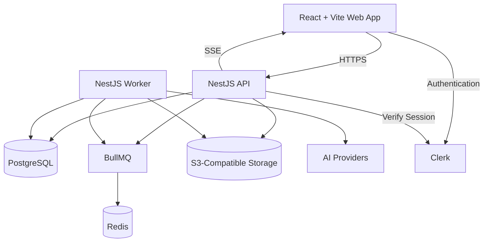
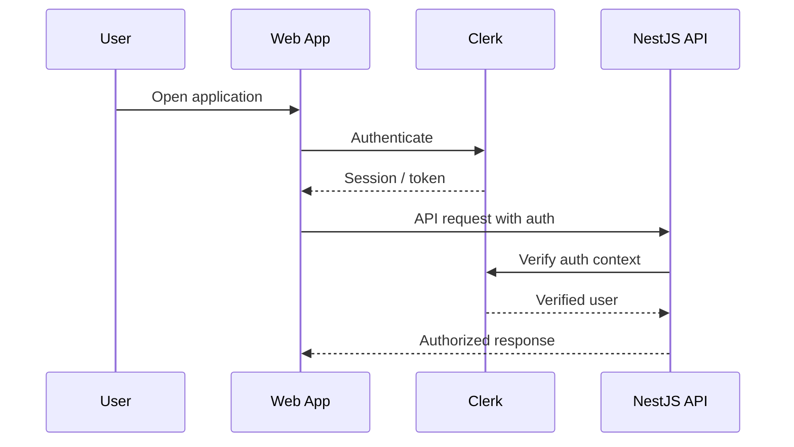
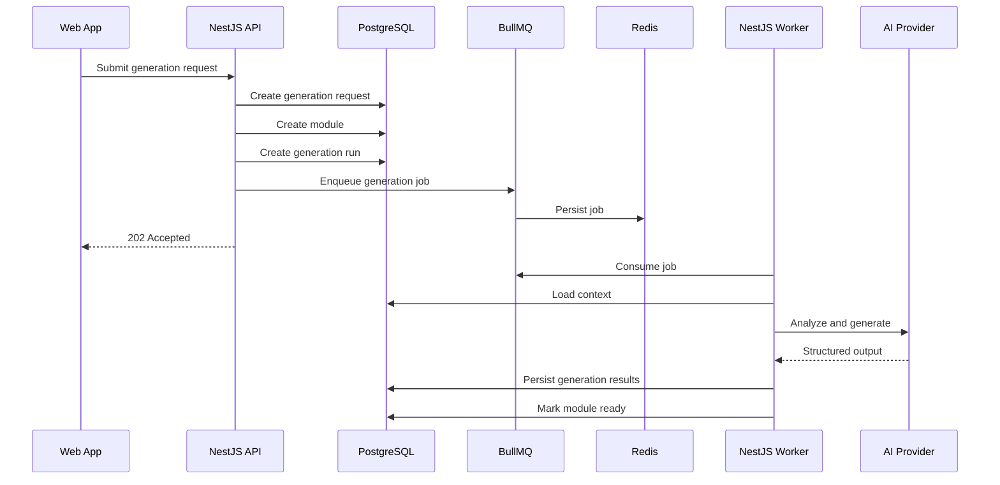
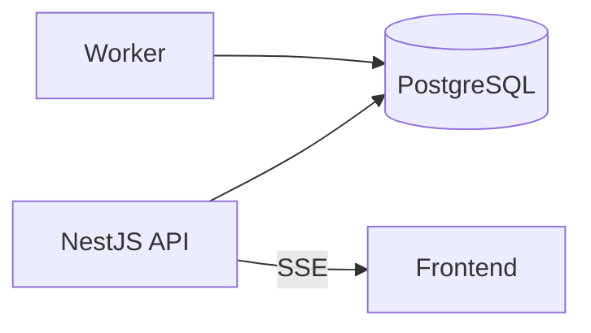
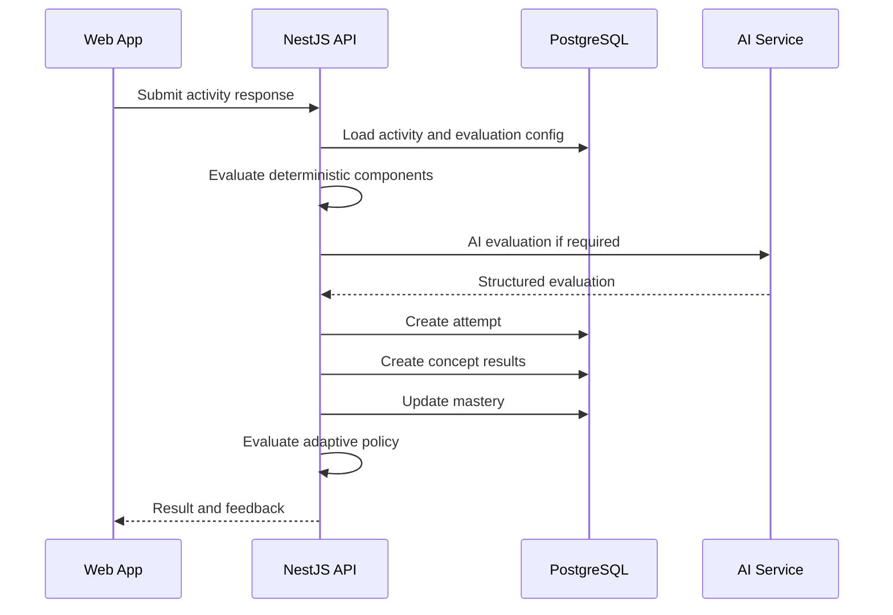
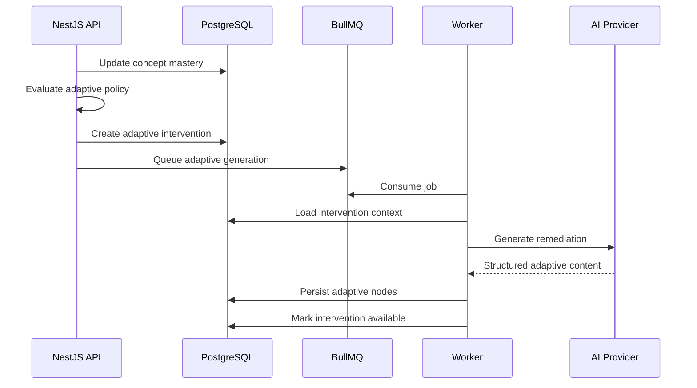

# Ngerti.in System Architecture Specification

## 1. Document Purpose

This document defines the baseline technical architecture for Ngerti.in v1.

The architecture prioritizes:

- Clear module boundaries
- Fast local development
- Durable background processing
- Independent API and worker processes
- PostgreSQL-first persistence
- AI provider flexibility
- Minimal infrastructure complexity
- Future extensibility

---

# 2. Technology Stack

## Runtime and Package Management

```text
Bun
```

Bun is used for:

- Runtime
- Package manager
- Workspace management
- Development scripts

---

## Frontend

```text
Vite
React
TypeScript
React Router
TanStack Query
Tailwind CSS
shadcn/ui
Motion
Clerk
```

---

## Backend

```text
NestJS
TypeScript
Zod
Clerk verification
```

---

## Persistence

```text
PostgreSQL
Drizzle ORM
```

---

## Background Processing

```text
Redis
BullMQ
NestJS Worker Application
```

---

## AI

```text
AI SDK Core
Zod
Provider SDKs
```

---

## Storage

```text
S3-compatible object storage
```

Possible providers:

- Cloudflare R2
- Amazon S3
- MinIO
- Backblaze B2

The application should depend on a storage abstraction rather than a provider-specific API in domain code.

---

# 3. High-Level Architecture



---

# 4. Monorepo Structure

Recommended baseline:

```text
ngertiin/
├── apps/
│   ├── web/
│   ├── api/
│   └── worker/
│
├── packages/
│   ├── database/
│   ├── contracts/
│   ├── storage/
│   └── shared/
│
├── docker-compose.yml
├── package.json
└── bun.lock
```

---

# 5. Bun Workspace

Recommended root workspace configuration:

```json
{
  "workspaces": ["apps/*", "packages/*"]
}
```

Internal packages should use workspace dependencies where appropriate.

Example:

```json
{
  "dependencies": {
    "@ngertiin/database": "workspace:*",
    "@ngertiin/contracts": "workspace:*"
  }
}
```

---

# 6. Frontend Responsibilities

The web application is responsible for:

- Authentication UI
- Dashboard
- Source input
- Generation request creation
- Generation progress display
- Learning journey rendering
- Activity interaction
- Attempt submission
- Feedback display
- Adaptive journey rendering
- User profile and gamification display

The frontend must not contain authoritative business rules for:

- Mastery calculation
- Adaptive thresholds
- XP calculation
- Authorization
- Node unlocking
- Generation state transitions

---

# 7. API Responsibilities

The NestJS API is responsible for:

- Authentication verification
- Authorization
- Source management
- Generation request creation
- Module queries
- Learning progress queries
- Attempt submission
- Evaluation orchestration
- Adaptive decision invocation
- Queue job creation
- SSE generation updates
- Storage upload coordination

The API should remain responsive and avoid long-running generation tasks.

---

# 8. Worker Responsibilities

The NestJS worker application is responsible for:

- Source extraction
- URL content normalization
- Module generation
- Adaptive generation
- AI calls
- Generation validation
- Generation retries
- Long-running processing

The worker is a separate process from the API.

It may share NestJS modules and internal packages.

---

# 9. API and Worker Separation

The API and worker are separate deployable processes but remain part of the same system and repository.

```text
apps/api
→ HTTP workload

apps/worker
→ background workload
```

This is not a microservice architecture.

Both applications may share:

```text
packages/database
packages/contracts
packages/storage
packages/shared
```

---

# 10. NestJS Module Boundaries

Recommended API modules:

```text
AuthModule
UsersModule
SourcesModule
GenerationRequestsModule
ModulesModule
LearningModule
AttemptsModule
AdaptiveModule
GamificationModule
GenerationStatusModule
```

Recommended worker modules:

```text
SourceProcessingModule
ModuleGenerationModule
AdaptiveGenerationModule
AiModule
StorageModule
DatabaseModule
QueueModule
```

---

# 11. Database Layer

Drizzle ORM is used as the primary database access layer.

Recommended package:

```text
packages/database
├── schema/
├── migrations/
├── client.ts
└── repositories/
```

The database schema is defined in:

```text
Ngerti.in Database ERD Specification
```

PostgreSQL remains the source of truth for durable application state.

---

# 12. Local Infrastructure

Recommended `docker-compose.yml` services:

```text
postgres
redis
minio
```

`minio` is optional if a local filesystem storage adapter is used during early development.

Application processes should run natively with Bun during development.

Example:

```text
bun dev
```

Docker should be used primarily for infrastructure dependencies.

---

# 13. Authentication Architecture



A local user record is mapped using:

```text
users.clerk_user_id
```

---

# 14. Source Storage Architecture

## PDF

```text
Browser
↓
API / Upload Flow
↓
S3-Compatible Storage
↓
sources.storage_key
↓
Worker Extraction
↓
source_contents
```

The database should not store PDF binary files.

---

# 15. Module Generation Architecture



---

# 16. BullMQ Queues

Recommended initial queues:

```text
source-processing
module-generation
adaptive-generation
```

Avoid creating a queue for every minor implementation detail unless required for scaling or isolation.

---

# 17. Job Payload Design

Job payloads should contain stable identifiers, not large source content.

Example:

```ts
type GenerateModuleJob = {
  generationRunId: string;
  moduleId: string;
  generationRequestId: string;
};
```

The worker loads authoritative data from PostgreSQL.

This reduces Redis payload size and prevents stale duplicated context.

---

# 18. Job Retry Policy

BullMQ manages infrastructure-level retry.

Recommended retry targets:

- Provider timeout
- Temporary network failure
- Temporary storage failure
- Recoverable extraction failure

Permanent validation failures should not retry indefinitely.

Retry count and backoff should be configured by queue type.

---

# 19. Job Idempotency

Workers must assume jobs may execute more than once.

Worker operations must be idempotent.

Recommended safeguards:

- Stable `generation_run_id`
- Check current generation status
- Use unique database constraints
- Use transactions for finalization
- Avoid blind repeated inserts
- Store step completion state
- Reuse persisted source extraction output

---

# 20. Generation Progress

Generation progress is persisted in:

```text
generation_runs
generation_run_steps
```

Frontend delivery can use:

```text
Server-Sent Events
```

SSE is preferred over WebSocket for generation progress because communication is primarily server-to-client.

---

# 21. SSE Architecture



The API may:

- Poll generation state internally
- Subscribe to application events
- Read updated generation state before sending SSE messages

The durable state remains in PostgreSQL.

---

# 22. Attempt Submission Architecture



Adaptive generation may be queued after the attempt transaction completes.

---

# 23. Adaptive Generation Architecture



---

# 24. AI Layer

The AI layer should remain independent from queue orchestration and other infrastructure concerns, while staying internal to the worker application.

Recommended structure:

```text
apps/worker/src/ai
```

Responsibilities:

- Model registry
- Prompt construction
- Structured generation
- Output schema validation
- Generation-specific services
- Assessment and feedback generation
- Adaptive content generation

The AI layer may be organized into internal modules such as:

```text
apps/worker/src/ai/
├── models/
├── analysis/
├── concepts/
├── curriculum/
├── activities/
├── evaluation/
└── adaptive/
```

The worker orchestration layer is responsible for deciding when AI operations are executed, managing BullMQ jobs, retries, generation state, and persistence flow.

Business policies such as mastery thresholds, adaptive intervention rules, progress calculation, and XP allocation must remain outside the AI layer.

The AI layer should only be extracted into a shared package if multiple applications or processes later require the same AI implementation.

---

# 25. Storage Abstraction

Recommended interface:

```ts
interface StorageService {
  put(input: PutObjectInput): Promise<StoredObject>;
  get(key: string): Promise<ReadableStream | Buffer>;
  delete(key: string): Promise<void>;
  createSignedUrl?(key: string): Promise<string>;
}
```

Production and local adapters may differ.

---

# 26. Contracts Package

Recommended:

```text
packages/contracts
```

Contains shared:

- Zod schemas
- API DTO contracts
- Activity payload types
- Generation event types
- Enum definitions where appropriate

Database entities should not automatically become public API response types.

---

# 27. Error Handling

Errors should be categorized.

Recommended categories:

```text
VALIDATION_ERROR
AUTHENTICATION_ERROR
AUTHORIZATION_ERROR
NOT_FOUND
SOURCE_PROCESSING_ERROR
GENERATION_ERROR
AI_PROVIDER_ERROR
STORAGE_ERROR
QUEUE_ERROR
INTERNAL_ERROR
```

User-facing messages should not expose internal provider or stack information.

---

# 28. Observability

Recommended baseline:

```text
Sentry
structured application logs
generation run metadata
BullMQ monitoring
PostgreSQL metrics
```

Future AI observability:

```text
Langfuse
```

Useful trace identifiers:

```text
request_id
user_id
module_id
generation_run_id
bullmq_job_id
adaptive_intervention_id
```

---

# 29. Deployment Model

Baseline deployment units:

```text
web
api
worker
postgres
redis
object-storage
```

In production, PostgreSQL, Redis, and object storage may be managed externally.

The application should not assume local Docker services exist in production.

---

# 30. Scaling Strategy

Scale API and worker independently.

Example:

```text
API:
Scale based on HTTP traffic.

Worker:
Scale based on generation queue depth.

PostgreSQL:
Scale based on connection load and data volume.

Redis:
Scale based on BullMQ throughput.
```

The architecture should remain a modular monolith before introducing independent business microservices.

---

# 31. Technology Decisions

## Bun

Used for runtime, package management, and workspaces.

## NestJS

Used for backend structure, dependency injection, modules, API conventions, and worker organization.

## PostgreSQL

Used as the durable source of truth for application state.

## Drizzle

Used for explicit relational schema and database access.

## Redis + BullMQ

Used for durable background task execution and worker distribution.

## AI SDK Core

Used for provider abstraction and structured AI operations.

## Clerk

Used for authentication.

## S3-Compatible Storage

Used for binary learning sources.

## SSE

Used for server-to-client generation progress.

---

# 32. Explicit Non-Decisions

The following are intentionally excluded from the baseline architecture:

```text
Next.js
Supabase
NestJS microservices
Kafka
Kubernetes
Temporal
LangGraph
LangChain as core orchestration
Dedicated vector database
WebSocket for generation progress
Python AI backend
```

These may be introduced only after a concrete requirement justifies them.

---

# 33. Future Extension Points

Potential future additions:

- pgvector
- Dedicated retrieval service
- LangGraph
- Search indexing
- Shared/public modules
- Teacher assignment layer
- Classroom features
- Billing
- Feature flags
- More advanced mastery models
- Spaced repetition
- Content versioning

The current architecture must not require these features to exist.
