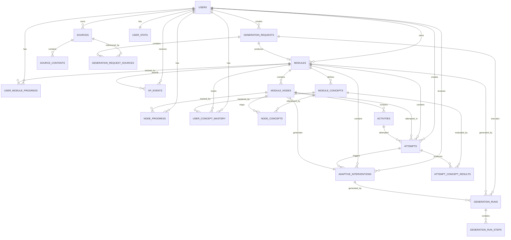
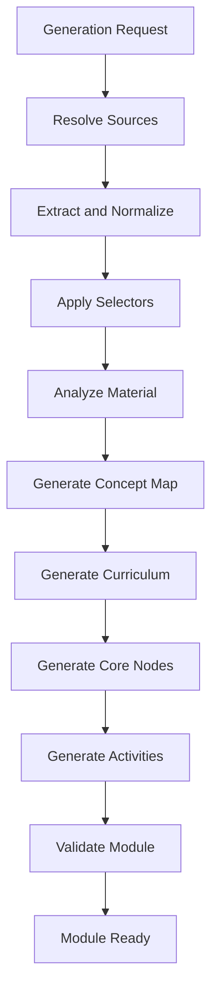
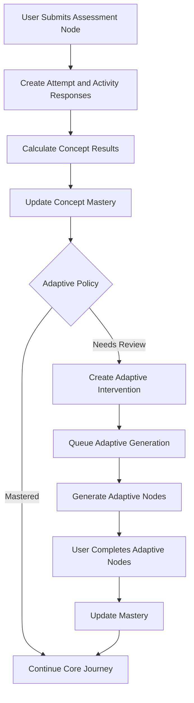

# Ngerti.in Database ERD Specification

## 1. Overview

This document defines the baseline relational database schema for Ngerti.in.

The schema supports:

- Clerk-based authentication mapping
- Multi-source module generation
- PDF, URL, and text sources
- Generation instructions and source selection
- Background module generation
- Core learning journey
- Semi-adaptive learning
- Concept mastery tracking
- User attempts and progress tracking
- XP and streak tracking

Primary database: PostgreSQL.

---

## 2. High-Level ERD



---

# 3. Tables

## 3.1 `users`

Stores the local application identity associated with Clerk.

| Column | Type | Constraints |
|---|---|---|
| `id` | `uuid` | PK |
| `clerk_user_id` | `varchar` | UNIQUE, NOT NULL |
| `display_name` | `varchar` | NULL |
| `timezone` | `varchar` | NOT NULL, DEFAULT `UTC` |
| `created_at` | `timestamptz` | NOT NULL |
| `updated_at` | `timestamptz` | NOT NULL |

### Notes

Clerk remains the source of truth for:

- Authentication
- Passwords
- Sessions
- OAuth identities
- Email verification

---

## 3.2 `sources`

Stores reusable learning materials submitted by users.

| Column | Type | Constraints |
|---|---|---|
| `id` | `uuid` | PK |
| `user_id` | `uuid` | FK → `users.id`, NOT NULL |
| `type` | `source_type` | NOT NULL |
| `title` | `varchar` | NULL |
| `storage_key` | `varchar` | NULL |
| `original_url` | `text` | NULL |
| `text_content` | `text` | NULL |
| `mime_type` | `varchar` | NULL |
| `original_filename` | `varchar` | NULL |
| `content_hash` | `varchar` | NULL |
| `status` | `source_status` | NOT NULL |
| `metadata` | `jsonb` | NULL |
| `created_at` | `timestamptz` | NOT NULL |
| `updated_at` | `timestamptz` | NOT NULL |

### Source Types

```text
pdf
url
text
```

---

## 3.3 `source_contents`

Stores normalized or extracted content from a source.

| Column | Type | Constraints |
|---|---|---|
| `id` | `uuid` | PK |
| `source_id` | `uuid` | FK → `sources.id`, NOT NULL |
| `type` | `source_content_type` | NOT NULL |
| `position` | `integer` | NOT NULL |
| `page_number` | `integer` | NULL |
| `heading` | `varchar` | NULL |
| `content` | `text` | NOT NULL |
| `metadata` | `jsonb` | NULL |
| `created_at` | `timestamptz` | NOT NULL |

### Example

A PDF may be represented as:

```text
source
├── page 1
├── page 2
├── page 3
└── ...
```

This allows page-specific generation without reprocessing the original file.

---

## 3.4 `generation_requests`

Represents a request to generate a learning module.

| Column | Type | Constraints |
|---|---|---|
| `id` | `uuid` | PK |
| `user_id` | `uuid` | FK → `users.id`, NOT NULL |
| `instruction` | `text` | NULL |
| `created_at` | `timestamptz` | NOT NULL |

### Example Instruction

```text
Focus on the digestive system material on pages 45-62 and target senior high school level.
```

`instruction` is not considered a learning source. It controls how the selected sources should be interpreted.

---

## 3.5 `generation_request_sources`

Associates one generation request with one or more sources.

| Column | Type | Constraints |
|---|---|---|
| `generation_request_id` | `uuid` | FK → `generation_requests.id`, NOT NULL |
| `source_id` | `uuid` | FK → `sources.id`, NOT NULL |
| `role` | `source_role` | NOT NULL |
| `priority` | `smallint` | NOT NULL |
| `selector` | `jsonb` | NULL |
| `created_at` | `timestamptz` | NOT NULL |

### Primary Key

```text
(generation_request_id, source_id)
```

### Source Roles

```text
primary
reference
supplementary
```

### Selector Example

```json
{
  "pages": {
    "from": 45,
    "to": 62
  }
}
```

---

## 3.6 `modules`

Stores generated learning modules.

| Column | Type | Constraints |
|---|---|---|
| `id` | `uuid` | PK |
| `owner_id` | `uuid` | FK → `users.id`, NOT NULL |
| `generation_request_id` | `uuid` | FK → `generation_requests.id`, NOT NULL |
| `title` | `varchar` | NOT NULL |
| `description` | `text` | NULL |
| `difficulty` | `module_difficulty` | NULL |
| `status` | `module_status` | NOT NULL |
| `estimated_minutes` | `integer` | NULL |
| `created_at` | `timestamptz` | NOT NULL |
| `updated_at` | `timestamptz` | NOT NULL |

---

## 3.7 `module_concepts`

Defines the concepts covered by a module.

| Column | Type | Constraints |
|---|---|---|
| `id` | `uuid` | PK |
| `module_id` | `uuid` | FK → `modules.id`, NOT NULL |
| `key` | `varchar` | NOT NULL |
| `name` | `varchar` | NOT NULL |
| `description` | `text` | NULL |
| `importance` | `numeric` | NULL |
| `position` | `integer` | NOT NULL |
| `created_at` | `timestamptz` | NOT NULL |

### Unique Constraint

```text
(module_id, key)
```

---

## 3.8 `module_nodes`

Represents nodes in the learning journey.

| Column | Type | Constraints |
|---|---|---|
| `id` | `uuid` | PK |
| `module_id` | `uuid` | FK → `modules.id`, NOT NULL |
| `origin` | `node_origin` | NOT NULL |
| `type` | `node_type` | NOT NULL |
| `title` | `varchar` | NOT NULL |
| `description` | `text` | NULL |
| `core_position` | `integer` | NULL |
| `adaptive_intervention_id` | `uuid` | FK → `adaptive_interventions.id`, NULL |
| `adaptive_position` | `integer` | NULL |
| `created_at` | `timestamptz` | NOT NULL |
| `updated_at` | `timestamptz` | NOT NULL |

### Origin

```text
core
adaptive
```

### Node Types

```text
lesson
flashcard
quiz
checkpoint
review
practice
remedial_quiz
```

### Invariants

For core nodes:

```text
origin = core
core_position IS NOT NULL
adaptive_intervention_id IS NULL
```

For adaptive nodes:

```text
origin = adaptive
adaptive_intervention_id IS NOT NULL
adaptive_position IS NOT NULL
```

---

## 3.9 `node_concepts`

Maps learning nodes to concepts.

| Column | Type | Constraints |
|---|---|---|
| `node_id` | `uuid` | FK → `module_nodes.id`, NOT NULL |
| `concept_id` | `uuid` | FK → `module_concepts.id`, NOT NULL |
| `relation` | `concept_relation` | NOT NULL |
| `weight` | `numeric` | NOT NULL |

### Primary Key

```text
(node_id, concept_id)
```

### Relation Types

```text
teach
review
assess
```

---

## 3.10 `activities`

Stores the executable learning content associated with a node.

| Column | Type | Constraints |
|---|---|---|
| `id` | `uuid` | PK |
| `node_id` | `uuid` | FK → `module_nodes.id`, NOT NULL |
| `type` | `activity_type` | NOT NULL |
| `position` | `integer` | NOT NULL |
| `content` | `jsonb` | NOT NULL |
| `evaluation_config` | `jsonb` | NULL |
| `schema_version` | `integer` | NOT NULL, DEFAULT 1 |
| `created_at` | `timestamptz` | NOT NULL |
| `updated_at` | `timestamptz` | NOT NULL |

### Example `content`

```json
{
  "question": "What is the primary function of pepsin?",
  "options": [
    "Break down proteins",
    "Break down fats",
    "Absorb vitamins"
  ]
}
```

### Example `evaluation_config`

```json
{
  "correctAnswer": 0,
  "explanation": "Pepsin is a proteolytic enzyme that breaks proteins into smaller peptides."
}
```

`evaluation_config` must remain server-side and must not be exposed directly to the client before an attempt is evaluated.

---

## 3.11 `generation_runs`

Tracks asynchronous module or adaptive generation.

| Column | Type | Constraints |
|---|---|---|
| `id` | `uuid` | PK |
| `user_id` | `uuid` | FK → `users.id`, NOT NULL |
| `module_id` | `uuid` | FK → `modules.id`, NOT NULL |
| `generation_request_id` | `uuid` | FK → `generation_requests.id`, NULL |
| `adaptive_intervention_id` | `uuid` | FK → `adaptive_interventions.id`, NULL |
| `type` | `generation_type` | NOT NULL |
| `bullmq_job_id` | `varchar` | NULL |
| `status` | `generation_status` | NOT NULL |
| `progress_percentage` | `integer` | NOT NULL |
| `error` | `jsonb` | NULL |
| `metadata` | `jsonb` | NULL |
| `started_at` | `timestamptz` | NULL |
| `finished_at` | `timestamptz` | NULL |
| `created_at` | `timestamptz` | NOT NULL |

### Generation Types

```text
module
adaptive
```

---

## 3.12 `generation_run_steps`

Tracks individual generation workflow steps.

| Column | Type | Constraints |
|---|---|---|
| `id` | `uuid` | PK |
| `generation_run_id` | `uuid` | FK → `generation_runs.id`, NOT NULL |
| `step` | `varchar` | NOT NULL |
| `position` | `integer` | NOT NULL |
| `status` | `generation_step_status` | NOT NULL |
| `metadata` | `jsonb` | NULL |
| `error` | `jsonb` | NULL |
| `started_at` | `timestamptz` | NULL |
| `finished_at` | `timestamptz` | NULL |

### Example Steps

```text
extract_sources
analyze_material
create_curriculum
generate_activities
validate_module
```

---

## 3.13 `user_module_progress`

Stores module-level progress for each user.

| Column | Type | Constraints |
|---|---|---|
| `id` | `uuid` | PK |
| `user_id` | `uuid` | FK → `users.id`, NOT NULL |
| `module_id` | `uuid` | FK → `modules.id`, NOT NULL |
| `status` | `module_progress_status` | NOT NULL |
| `current_node_id` | `uuid` | FK → `module_nodes.id`, NULL |
| `progress_percentage` | `numeric` | NOT NULL |
| `started_at` | `timestamptz` | NULL |
| `completed_at` | `timestamptz` | NULL |
| `updated_at` | `timestamptz` | NOT NULL |

### Unique Constraint

```text
(user_id, module_id)
```

---

## 3.14 `node_progress`

Stores per-node learning progress.

| Column | Type | Constraints |
|---|---|---|
| `id` | `uuid` | PK |
| `user_id` | `uuid` | FK → `users.id`, NOT NULL |
| `node_id` | `uuid` | FK → `module_nodes.id`, NOT NULL |
| `status` | `node_progress_status` | NOT NULL |
| `best_score` | `numeric` | NULL |
| `attempt_count` | `integer` | NOT NULL, DEFAULT 0 |
| `started_at` | `timestamptz` | NULL |
| `completed_at` | `timestamptz` | NULL |
| `updated_at` | `timestamptz` | NOT NULL |

### Unique Constraint

```text
(user_id, node_id)
```

---

## 3.15 `attempts`

Stores every immutable assessment submission at user-and-node scope.

| Column | Type | Constraints |
|---|---|---|
| `id` | `uuid` | PK |
| `user_id` | `uuid` | FK → `users.id`, NOT NULL |
| `module_id` | `uuid` | FK → `modules.id`, NOT NULL |
| `node_id` | `uuid` | FK → `module_nodes.id`, NOT NULL |
| `submission_id` | `uuid` | NOT NULL, unique per user |
| `submission_hash` | `varchar(64)` | NOT NULL, server-only replay fingerprint |
| `attempt_number` | `integer` | NOT NULL |
| `evaluation_status` | `attempt_evaluation_status` | NOT NULL |
| `score` | `numeric` | NULL |
| `max_score` | `numeric` | NULL |
| `policy_outcome` | `attempt_policy_outcome` | NULL |
| `xp_awarded` | `integer` | NOT NULL, DEFAULT 0 |
| `failure` | `jsonb` | NULL, safe metadata only |
| `evaluated_at` | `timestamptz` | NULL |
| `created_at` | `timestamptz` | NOT NULL |

### Unique Constraints

```text
(user_id, submission_id)
(user_id, node_id, attempt_number)
```

---

## 3.16 `attempt_responses`

Stores immutable per-Activity answers and safe deterministic evaluation results.

| Column | Type | Constraints |
|---|---|---|
| `attempt_id` | `uuid` | FK → `attempts.id`, NOT NULL |
| `activity_id` | `uuid` | FK → `activities.id`, NOT NULL |
| `response` | `jsonb` | NOT NULL |
| `score` | `numeric` | NULL |
| `max_score` | `numeric` | NULL |
| `evaluation` | `jsonb` | NULL, safe result only |
| `created_at` | `timestamptz` | NOT NULL |

Primary key: `(attempt_id, activity_id)`.

---

## 3.17 `attempt_concept_results`

Stores concept-level performance derived from an attempt.

| Column | Type | Constraints |
|---|---|---|
| `attempt_id` | `uuid` | FK → `attempts.id`, NOT NULL |
| `concept_id` | `uuid` | FK → `module_concepts.id`, NOT NULL |
| `performance_score` | `numeric` | NOT NULL |
| `mastery_score` | `numeric` | NOT NULL |
| `confidence_score` | `numeric` | NOT NULL |
| `evidence_count` | `integer` | NOT NULL |

### Primary Key

```text
(attempt_id, concept_id)
```

---

## 3.18 `user_concept_mastery`

Stores current mastery state for each concept.

| Column | Type | Constraints |
|---|---|---|
| `user_id` | `uuid` | FK → `users.id`, NOT NULL |
| `module_id` | `uuid` | FK → `modules.id`, NOT NULL |
| `concept_id` | `uuid` | FK → `module_concepts.id`, NOT NULL |
| `mastery_score` | `numeric` | NOT NULL |
| `confidence_score` | `numeric` | NOT NULL |
| `evidence_count` | `integer` | NOT NULL |
| `updated_at` | `timestamptz` | NOT NULL |

### Primary Key

```text
(user_id, module_id, concept_id)
```

### Recommended Range

```text
mastery_score    0.0 - 1.0
confidence_score 0.0 - 1.0
```

---

## 3.19 `adaptive_interventions`

Represents an on-demand adaptive learning branch generated for a specific user.

| Column | Type | Constraints |
|---|---|---|
| `id` | `uuid` | PK |
| `user_id` | `uuid` | FK → `users.id`, NOT NULL |
| `module_id` | `uuid` | FK → `modules.id`, NOT NULL |
| `trigger_node_id` | `uuid` | FK → `module_nodes.id`, NOT NULL |
| `trigger_attempt_id` | `uuid` | FK → `attempts.id`, NOT NULL |
| `resume_node_id` | `uuid` | FK → `module_nodes.id`, NULL |
| `reason_code` | `varchar` | NOT NULL |
| `reason_summary` | `text` | NULL |
| `status` | `adaptive_status` | NOT NULL |
| `created_at` | `timestamptz` | NOT NULL |
| `completed_at` | `timestamptz` | NULL |

### Lifecycle

```text
Core Node
   ↓
Attempt
   ↓
Concept Mastery Update
   ↓
Adaptive Policy
   ↓
Adaptive Intervention
   ↓
Adaptive Nodes
   ↓
Resume Core Journey
```

---

## 3.20 `user_stats`

Stores global gamification statistics.

| Column | Type | Constraints |
|---|---|---|
| `user_id` | `uuid` | PK, FK → `users.id` |
| `total_xp` | `integer` | NOT NULL, DEFAULT 0 |
| `current_streak` | `integer` | NOT NULL, DEFAULT 0 |
| `longest_streak` | `integer` | NOT NULL, DEFAULT 0 |
| `last_learning_date` | `date` | NULL |
| `updated_at` | `timestamptz` | NOT NULL |

---

## 3.21 `xp_events`

Stores the XP ledger.

| Column | Type | Constraints |
|---|---|---|
| `id` | `uuid` | PK |
| `user_id` | `uuid` | FK → `users.id`, NOT NULL |
| `module_id` | `uuid` | FK → `modules.id`, NULL |
| `amount` | `integer` | NOT NULL |
| `reason` | `xp_reason` | NOT NULL |
| `reference_id` | `uuid` | NULL |
| `created_at` | `timestamptz` | NOT NULL |

XP should be derived from ledger entries rather than only mutating `user_stats.total_xp`.

---

# 4. Enum Catalogue

## `source_type`

```text
pdf
url
text
```

## `source_status`

```text
pending
processing
ready
failed
```

## `source_content_type`

```text
page
section
content
```

## `source_role`

```text
primary
reference
supplementary
```

## `module_difficulty`

```text
beginner
intermediate
advanced
```

## `module_status`

```text
generating
ready
failed
archived
```

## `node_origin`

```text
core
adaptive
```

## `node_type`

```text
lesson
flashcard
quiz
checkpoint
review
practice
remedial_quiz
```

## `concept_relation`

```text
teach
review
assess
```

## `generation_type`

```text
module
adaptive
```

## `generation_status`

```text
queued
processing
completed
failed
```

## `generation_step_status`

```text
pending
processing
completed
failed
```

## `module_progress_status`

```text
not_started
in_progress
completed
```

## `node_progress_status`

```text
locked
available
in_progress
completed
```

## `adaptive_status`

```text
generating
available
in_progress
completed
failed
skipped
```

## `xp_reason`

```text
node_completed
quiz_completed
perfect_score
checkpoint_completed
adaptive_completed
```

---

# 5. Adaptive Learning Rules

Adaptive content is generated on demand.

The initial module generation creates only core nodes.

Adaptive generation is triggered after evaluating user performance.

Recommended baseline policy:

```text
mastery_score >= 0.75
→ continue to next core node

mastery_score >= 0.50 and < 0.75
→ optional review

mastery_score < 0.50
→ adaptive intervention
```

The adaptive policy should be implemented deterministically in application logic.

The AI layer is responsible for generating remediation content, not deciding whether remediation is required.

---

# 6. Generation Lifecycle



---

# 7. Adaptive Lifecycle



---

# 8. Recommended Indexes

## `users`

```sql
CREATE UNIQUE INDEX users_clerk_user_id_idx
ON users (clerk_user_id);
```

## `sources`

```sql
CREATE INDEX sources_user_id_idx
ON sources (user_id);

CREATE INDEX sources_status_idx
ON sources (status);

CREATE INDEX sources_content_hash_idx
ON sources (content_hash);
```

## `source_contents`

```sql
CREATE INDEX source_contents_source_position_idx
ON source_contents (source_id, position);

CREATE INDEX source_contents_source_page_idx
ON source_contents (source_id, page_number);
```

## `generation_requests`

```sql
CREATE INDEX generation_requests_user_id_idx
ON generation_requests (user_id);
```

## `generation_request_sources`

```sql
CREATE INDEX generation_request_sources_source_id_idx
ON generation_request_sources (source_id);
```

## `modules`

```sql
CREATE INDEX modules_owner_id_idx
ON modules (owner_id);

CREATE INDEX modules_status_idx
ON modules (status);

CREATE INDEX modules_generation_request_idx
ON modules (generation_request_id);
```

## `module_concepts`

```sql
CREATE UNIQUE INDEX module_concepts_module_key_idx
ON module_concepts (module_id, key);
```

## `module_nodes`

```sql
CREATE INDEX module_nodes_module_origin_idx
ON module_nodes (module_id, origin);

CREATE INDEX module_nodes_core_position_idx
ON module_nodes (module_id, core_position);

CREATE INDEX module_nodes_adaptive_intervention_idx
ON module_nodes (adaptive_intervention_id);
```

## `activities`

```sql
CREATE INDEX activities_node_position_idx
ON activities (node_id, position);
```

## `generation_runs`

```sql
CREATE INDEX generation_runs_module_idx
ON generation_runs (module_id);

CREATE INDEX generation_runs_status_idx
ON generation_runs (status);

CREATE INDEX generation_runs_bullmq_job_idx
ON generation_runs (bullmq_job_id);
```

## `generation_run_steps`

```sql
CREATE INDEX generation_run_steps_run_position_idx
ON generation_run_steps (generation_run_id, position);
```

## `user_module_progress`

```sql
CREATE UNIQUE INDEX user_module_progress_user_module_idx
ON user_module_progress (user_id, module_id);
```

## `node_progress`

```sql
CREATE UNIQUE INDEX node_progress_user_node_idx
ON node_progress (user_id, node_id);
```

## `attempts`

```sql
CREATE INDEX attempts_user_module_idx
ON attempts (user_id, module_id);

CREATE INDEX attempts_node_idx
ON attempts (node_id);

CREATE UNIQUE INDEX attempts_user_submission_idx
ON attempts (user_id, submission_id);

CREATE UNIQUE INDEX attempts_user_node_number_idx
ON attempts (user_id, node_id, attempt_number);
```

## `user_concept_mastery`

```sql
CREATE INDEX user_concept_mastery_module_idx
ON user_concept_mastery (user_id, module_id);
```

## `adaptive_interventions`

```sql
CREATE INDEX adaptive_interventions_user_module_idx
ON adaptive_interventions (user_id, module_id);

CREATE INDEX adaptive_interventions_status_idx
ON adaptive_interventions (status);
```

## `xp_events`

```sql
CREATE INDEX xp_events_user_created_idx
ON xp_events (user_id, created_at DESC);
```

---

# 9. Recommended Constraints

## Mastery Range

```sql
CHECK (mastery_score >= 0 AND mastery_score <= 1)
```

```sql
CHECK (confidence_score >= 0 AND confidence_score <= 1)
```

## Progress Range

```sql
CHECK (
  progress_percentage >= 0
  AND progress_percentage <= 100
)
```

## Node Origin Integrity

Conceptually:

```text
core node:
- core_position required
- adaptive_intervention_id must be null
- adaptive_position must be null

adaptive node:
- adaptive_intervention_id required
- adaptive_position required
```

These rules should be enforced using PostgreSQL `CHECK` constraints where possible.

---

# 10. JSONB Boundaries

JSONB should only be used for data whose structure is intentionally polymorphic or provider-specific.

Recommended JSONB columns:

```text
sources.metadata
source_contents.metadata
generation_request_sources.selector

activities.content
activities.evaluation_config

attempts.failure
attempt_responses.response
attempt_responses.evaluation

generation_runs.error
generation_runs.metadata

generation_run_steps.error
generation_run_steps.metadata
```

Core domain entities should remain relational:

```text
users
sources
modules
concepts
nodes
activities
attempts
progress
mastery
adaptive interventions
generation runs
```

---

# 11. Core Domain Boundaries

## Source Domain

```text
sources
source_contents
generation_requests
generation_request_sources
```

## Learning Content Domain

```text
modules
module_concepts
module_nodes
node_concepts
activities
```

## Generation Domain

```text
generation_runs
generation_run_steps
```

## Learning Progress Domain

```text
user_module_progress
node_progress
attempts
attempt_responses
attempt_concept_results
user_concept_mastery
```

## Adaptive Learning Domain

```text
adaptive_interventions
adaptive module_nodes
```

## Gamification Domain

```text
user_stats
xp_events
```

---

# 12. Final Relationship Summary

```text
users
├── sources
│   └── source_contents
│
├── generation_requests
│   └── generation_request_sources
│       └── sources
│
├── modules
│   ├── module_concepts
│   │   ├── node_concepts
│   │   ├── attempt_concept_results
│   │   └── user_concept_mastery
│   │
│   ├── module_nodes
│   │   ├── node_concepts
│   │   ├── activities
│   │   └── node_progress
│   │
│   ├── generation_runs
│   │   └── generation_run_steps
│   │
│   ├── user_module_progress
│   ├── attempts
│   │   └── attempt_responses
│   └── adaptive_interventions
│       └── adaptive module_nodes
│
├── user_stats
└── xp_events
```

---

# 13. Baseline Table List

```text
1.  users
2.  sources
3.  source_contents
4.  generation_requests
5.  generation_request_sources
6.  modules
7.  module_concepts
8.  module_nodes
9.  node_concepts
10. activities
11. generation_runs
12. generation_run_steps
13. user_module_progress
14. node_progress
15. attempts
16. attempt_responses
17. attempt_concept_results
18. user_concept_mastery
19. adaptive_interventions
20. user_stats
21. xp_events
```
