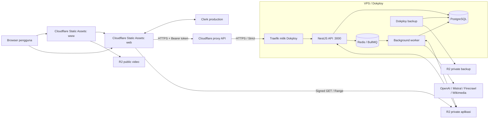

# Deployment Ngerti.in: arsitektur dan panduan operasional

Dokumen ini menjelaskan deployment production yang diterapkan pada **10 September 2026**, alasan pembagiannya, tempat konfigurasi disimpan, serta cara melakukan rilis dan pemulihan. Konfigurasi codebase dicocokkan kembali saat review dokumentasi; informasi dashboard dan hasil deployment di bawah merupakan snapshot sesi deployment, bukan audit ulang infrastruktur live.

**Status:** landing, web, API, worker, autentikasi, backup, dan CI frontend sudah terpasang. Pengguna melaporkan telah menguji E2E dan **“all good”**. Rincian kasus E2E tidak disertakan, sehingga laporan ini tidak dianggap sebagai bukti setiap skenario failure/recovery telah diuji.

## Daftar isi

1. [Arsitektur dan alasan pemilihan](#1-arsitektur-dan-alasan-pemilihan)
2. [Domain, DNS, TLS, dan CORS](#2-domain-dns-tls-dan-cors)
3. [Peta codebase dan resource production](#3-peta-codebase-dan-resource-production)
4. [Environment tiap aplikasi](#4-environment-tiap-aplikasi)
5. [Autentikasi Clerk](#5-autentikasi-clerk)
6. [Docker, database, dan worker](#6-docker-database-dan-worker)
7. [CI dan urutan release](#7-ci-dan-urutan-release)
8. [Backup dan restore](#8-backup-dan-restore)
9. [Rollback dan perubahan konfigurasi](#9-rollback-dan-perubahan-konfigurasi)
10. [Pemantauan dan troubleshooting](#10-pemantauan-dan-troubleshooting)
11. [Riwayat implementasi dan bukti verifikasi](#11-riwayat-implementasi-dan-bukti-verifikasi)

## 1. Arsitektur dan alasan pemilihan

| Komponen | Teknologi / tempat berjalan | Tanggung jawab |
| --- | --- | --- |
| `apps/www` | Astro static → Cloudflare Worker `ngertiin-www` | Landing dan tautan menuju aplikasi |
| `apps/web` | React + Vite SPA → Cloudflare Worker `ngertiin-web` | UI belajar; mengakses Clerk, API, dan signed URL file |
| `apps/api` | Bun + NestJS → container Dokploy | Verifikasi identitas, akses data, upload, quota, enqueue job, progres |
| `apps/worker` | Bun + NestJS + BullMQ → container Dokploy | Pemrosesan materi, generasi modul, evaluasi, adaptive generation |
| PostgreSQL | PostgreSQL 17 → resource Dokploy | Data produk dan schema aplikasi |
| Redis | Redis 7 → resource Dokploy | Antrean BullMQ dan kebutuhan koordinasi/cache aplikasi |
| Clerk | Layanan eksternal, instance production | Identitas, login sosial, dan sesi pengguna |
| R2 aplikasi | Bucket private `ngertiin-production` | File materi dan objek aplikasi |
| R2 aset | Bucket `ngertiin-assets`, custom domain public | Video landing |
| R2 backup | Bucket private `ngertiin-backups` | Backup PostgreSQL, dengan kredensial terpisah |
| GitHub Actions + GHCR | Build pipeline dan container registry | Build, validasi, distribusi image, deployment frontend |



**Mengapa frontend di Cloudflare?** Kedua frontend menghasilkan file statis di `dist`; tidak memerlukan server SSR. Cloudflare menyajikannya dekat pengguna, sementara VPS difokuskan pada API, database, dan pekerjaan latar belakang. SPA memakai fallback ke `index.html` agar refresh `/settings`, `/sources/...`, atau `/sign-in/...` tetap bekerja.

**Mengapa API dan worker di VPS?** Codebase sudah menggunakan proses Bun/NestJS, koneksi PostgreSQL/Redis, dependency native, serta pekerjaan AI/OCR yang berjalan di background. Docker menjaga lingkungan runtime konsisten tanpa memindahkan implementasi backend ke runtime Cloudflare.

Istilah **Cloudflare Worker** di frontend berarti deployment Static Assets. **Background worker aplikasi** adalah proses BullMQ di VPS. Keduanya berbeda fungsi dan lifecycle.

### Alur data yang perlu dipahami

1. Browser mengambil UI statis dan login melalui Clerk.
2. Web mengirim token Clerk sebagai `Authorization: Bearer ...` ke API. API memverifikasi token lalu memastikan profil lokal tersedia di PostgreSQL.
3. Pengguna menambahkan materi. Upload file saat ini melalui API, bukan upload langsung dengan signed PUT ke R2.
4. Untuk proses asynchronous, API memasukkan pekerjaan ke Redis/BullMQ. Worker mengambilnya, menghubungi provider yang diperlukan, lalu menyimpan hasil ke PostgreSQL/R2.
5. Web memperoleh progres/hasil melalui API, termasuk endpoint streaming yang digunakan fitur terkait.
6. File private dapat dibaca browser melalui signed GET URL sementara. Bucket tetap private walaupun URL tersebut dapat dipakai selama masih valid.

## 2. Domain, DNS, TLS, dan CORS

### Domain production

| Hostname | Tujuan | Pengelola |
| --- | --- | --- |
| `ngertiin.whoismanik.dev` | Landing | Wrangler custom domain |
| `app-ngertiin.whoismanik.dev` | React SPA | Wrangler custom domain |
| `api-ngertiin.whoismanik.dev` | API di VPS | DNS Cloudflare + Dokploy Domains |
| `ngertiin-assets.whoismanik.dev` | Video public | R2 custom domain |
| `clerk.app-ngertiin.whoismanik.dev` | Clerk Frontend API | CNAME dari Clerk |
| `accounts.app-ngertiin.whoismanik.dev` | Clerk Account Portal | CNAME dari Clerk |

Domain aplikasi memakai subdomain sejajar seperti `app-ngertiin`, sementara hostname layanan Clerk berada di bawah domain aplikasi. Jangan membuat A record frontend ke VPS: custom domain frontend dikelola oleh Wrangler.

### Jalur HTTPS API

A record `api-ngertiin` dibuat ke VPS **`145.79.12.17`**, awalnya DNS-only. Dokploy Domains diarahkan ke service Compose `api`, port **3000**, path `/`, tanpa strip prefix, dengan HTTPS/Let's Encrypt. Setelah sertifikat origin valid, record diaktifkan sebagai **Proxied**.

Ada dua koneksi TLS: browser → Cloudflare, lalu Cloudflare → Traefik di VPS. Rule **`Ngertiin API strict TLS`** menetapkan SSL `Strict` pada ekspresi:

```text
(http.host eq "api-ngertiin.whoismanik.dev")
```

Rule tersebut memvalidasi sertifikat origin khusus hostname API. Mode TLS global zone tidak diubah karena zone juga dipakai aplikasi lain. Rule **`Ngertiin API bypass cache`** menggunakan ekspresi yang sama dengan aksi bypass cache. API juga memasang `Cache-Control: private, no-store` melalui middleware untuk path `/api/v1/`.

### CORS API dan R2 adalah dua konfigurasi berbeda

- **API:** `WEB_ORIGIN=https://app-ngertiin.whoismanik.dev`; exposed headers `X-Request-Id` dan `Retry-After`. Preflight dengan header Authorization sudah diperiksa.
- **R2 aplikasi:** diperlukan karena browser mengambil file dari signed URL pada origin R2, termasuk range request pembaca PDF.

CORS bucket `ngertiin-production` yang disimpan:

```json
[
  {
    "AllowedOrigins": ["https://app-ngertiin.whoismanik.dev"],
    "AllowedMethods": ["GET", "HEAD"],
    "AllowedHeaders": ["Range"],
    "ExposeHeaders": ["ETag", "Content-Length", "Content-Range", "Accept-Ranges"]
  }
]
```

CORS mengatur akses browser; ia tidak menggantikan verifikasi token atau kepemilikan data. Di codebase saat review, `verifyToken` menggunakan Clerk secret tanpa parameter `authorizedParties` eksplisit. Jangan menyamakan pembatasan CORS dengan validasi claim `azp` pada token.

## 3. Peta codebase dan resource production

### File yang menjadi sumber konfigurasi

| File | Fungsi |
| --- | --- |
| [`Dockerfile`](../Dockerfile) | Target image API, worker, dan migrasi |
| [`.dockerignore`](../.dockerignore) | Mengecualikan dotenv, Git, build lokal, dependency lokal, dan log dari Docker context |
| [`compose.production.yml`](../compose.production.yml) | Runtime API/worker, migrasi opsional, network, healthcheck, log rotation |
| [`.env.production.example`](../.env.production.example) | Template environment resource backend Dokploy |
| [`apps/web/wrangler.jsonc`](../apps/web/wrangler.jsonc) | Static Assets SPA dan custom domain web |
| [`apps/www/wrangler.jsonc`](../apps/www/wrangler.jsonc) | Static Assets landing dan custom domain www |
| [`apps/web/.env.production.example`](../apps/web/.env.production.example) | Env publik build React |
| [`apps/www/.env.production.example`](../apps/www/.env.production.example) | Env publik build Astro |
| [`backend-images.yml`](../.github/workflows/backend-images.yml) | Validasi dan publish tiga image ke GHCR |
| [`frontend-deploy.yml`](../.github/workflows/frontend-deploy.yml) | Build dan deploy satu frontend pilihan ke Cloudflare |
| [`packages/contracts/src/environment/models`](../packages/contracts/src/environment/models) | Schema Zod dan default env API/worker/web |
| [`packages/database/drizzle.config.ts`](../packages/database/drizzle.config.ts) | Konfigurasi migrasi PostgreSQL |
| [`apps/web/vite.config.ts`](../apps/web/vite.config.ts) | Penempatan aset PDF.js di hasil build |

**Batas otomatisasi:** konfigurasi source tersimpan di Git. Resource native PostgreSQL/Redis, environment rahasia, domain Dokploy, aturan Cloudflare, bucket/CORS, Clerk, dan jadwal backup dibuat melalui dashboard/API saat provisioning. Clone repository saja belum membuat semua resource tersebut.

### Resource Dokploy

Dashboard: `https://dokploy.aqshara.com`. Versi yang diamati saat setup: **0.29.11**.

| Resource | Nama / konfigurasi |
| --- | --- |
| Project / environment | `ngertiin` / `production` |
| Backend Compose | `ngertiin-backend`; app name `ngertiin-ngertiinbackend-wmkjjx` |
| Source backend | `https://github.com/manikandareas/ngertiin-v2.git`, provider Git, branch `main`, path `./compose.production.yml` |
| Auto-deploy backend | Nonaktif; deploy dilakukan setelah migrasi siap |
| PostgreSQL | `ngertiin-postgres`, image `postgres:17-alpine`, database/user `ngertiin` |
| Host PostgreSQL internal | `ngertiin-ngertiinpostgres-ton2ja:5432` |
| Redis | `ngertiin-redis`, image `redis:7-alpine`, password unik |
| Host Redis internal | `ngertiin-ngertiinredis-kqluc9:6379` |
| Network bersama | `dokploy-network`, diverifikasi terhubung ke kedua database |
| Migrasi satu kali | Resource `ngertiin-migrate`, auto-deploy nonaktif |
| Tujuan backup | `ngertiin-production-backups` |

Database dan Redis adalah resource native Dokploy, bukan service di Compose backend. Keduanya memakai persistent volume dan tidak mempublikasikan port database ke host. `dokploy-network` adalah jaringan bersama Dokploy, bukan jaringan privat eksklusif project ini; isolasi lintas-project harus dinilai jika kebutuhan keamanan meningkat.

## 4. Environment tiap aplikasi

### Cara membaca environment

- **Build-time:** dibaca saat frontend dibangun dan nilainya masuk ke file JavaScript/HTML. Mengubahnya memerlukan build + deploy ulang.
- **Runtime:** dibaca ketika proses API/worker mulai. Mengubah environment Dokploy memerlukan redeploy agar container menerima nilai baru.
- **Compose interpolation:** digunakan Docker Compose untuk memilih image/network dan meneruskan env. Tidak semua variable resource Dokploy masuk ke setiap container.
- **Rahasia:** hanya contoh placeholder di Git. Nilai asli disimpan di GitHub Secrets, Dokploy, atau dashboard provider.

Tabel berikut mencatat nilai production yang terdokumentasi atau default Compose. Nilai rahasia dan model yang tidak tercatat secara eksplisit tidak direkonstruksi dari file `.env` development. Untuk nilai runtime paling baru, lihat environment Dokploy.

### `apps/www` — Astro landing

Template: [`apps/www/.env.production.example`](../apps/www/.env.production.example). Semua variable ini **publik, build-time**.

| Variable | Nilai production | Fungsi |
| --- | --- | --- |
| `PUBLIC_SITE_URL` | `https://ngertiin.whoismanik.dev` | URL situs untuk metadata/link absolut |
| `PUBLIC_APP_URL` | `https://app-ngertiin.whoismanik.dev` | Tujuan CTA ke aplikasi |
| `PUBLIC_ASSETS_URL` | `https://ngertiin-assets.whoismanik.dev` | Base URL video landing; komponen membentuk `/videos/<name>-v1.mp4` |

Di CI, ketiganya ditetapkan pada `env` workflow. Di laptop, gunakan `.env.production` dalam direktori `apps/www`. Tidak ada API secret, database URL, atau R2 access key di landing.

### `apps/web` — React SPA

Template: [`apps/web/.env.production.example`](../apps/web/.env.production.example). Keduanya **publik, build-time**.

| Variable | Nilai / sumber | Fungsi |
| --- | --- | --- |
| `VITE_API_URL` | `https://api-ngertiin.whoismanik.dev` | Origin API; **tanpa `/api/v1`**, karena client menambahkan prefix sendiri |
| `VITE_CLERK_PUBLISHABLE_KEY` | `pk_live_...` dari Clerk production; GitHub environment variable | Menghubungkan SDK browser dengan instance Clerk production |

Publishable key memang ditujukan untuk browser. `CLERK_SECRET_KEY` tidak boleh menggunakan prefix `VITE_` atau berada di bundle frontend. Key development `pk_test_...` tidak dipakai pada production.

### Compose — pemilihan image dan network

Diisi pada **Dokploy → ngertiin-backend → Environment** bersama env backend lain.

| Variable | Nilai / contoh | Dipakai oleh |
| --- | --- | --- |
| `BACKEND_IMAGE` | `ghcr.io/manikandareas/ngertiin-v2` | Compose membentuk nama image dengan suffix `-api`, `-worker`, `-migrate` |
| `RELEASE_TAG` | Full SHA commit yang image-nya sudah berhasil terbit | Ketiga image; jangan isi `latest` atau SHA commit docs yang belum dibuild |
| `BACKEND_NETWORK` | `dokploy-network` | Koneksi container ke database/Redis yang sudah ada |

Ketiga variable ini tidak diteruskan sebagai env aplikasi. Compose menggunakan `${VAR:?message}` untuk konfigurasi wajib: nilai hilang/kosong menyebabkan deployment gagal lebih awal.

### Infrastructure env — API dan worker

Semua variable berikut diteruskan ke **API dan worker**. Service migrasi hanya memakai `DATABASE_URL`.

| Variable | Nilai / bentuk production | Rahasia | Fungsi |
| --- | --- | --- | --- |
| `DATABASE_URL` | `postgres://ngertiin:<password>@ngertiin-ngertiinpostgres-ton2ja:5432/ngertiin` | Ya | Koneksi PostgreSQL; encode karakter khusus password pada URL |
| `REDIS_URL` | `redis://:<password>@ngertiin-ngertiinredis-kqluc9:6379` | Ya | Koneksi Redis berpassword |
| `S3_ENDPOINT` | `https://e9761bfb4099b77d294a05dfd827504f.r2.cloudflarestorage.com` | Tidak | Endpoint API S3 R2, bukan custom domain aset |
| `S3_REGION` | `auto` | Tidak | Region SDK S3 untuk R2 |
| `S3_ACCESS_KEY` | Access Key ID token R2 aplikasi | Ya | Identitas kredensial storage |
| `S3_SECRET_KEY` | Secret Access Key token R2 aplikasi | Ya | Secret penandatanganan request S3 |
| `S3_BUCKET` | `ngertiin-production` | Tidak | Bucket private aplikasi |
| `S3_FORCE_PATH_STYLE` | `true` | Tidak | Konfigurasi path-style AWS SDK; env boolean memakai string `true`/`false` |

Token aplikasi bernama `ngertiin-production-storage`, dengan Object Read & Write hanya pada bucket aplikasi. Cloudflare R2 juga menampilkan token API biasa saat pembuatan; env S3 memakai pasangan **Access Key ID / Secret Access Key**, bukan token bearer tersebut.

### `apps/api` — runtime khusus API

| Variable | Nilai production / default Compose | Rahasia | Fungsi |
| --- | --- | --- | --- |
| `NODE_ENV` | `production` | Tidak | Ditetapkan langsung oleh Compose |
| `API_PORT` | `3000` | Tidak | Port container; ditetapkan langsung oleh Compose |
| `WEB_ORIGIN` | `https://app-ngertiin.whoismanik.dev` | Tidak | Origin CORS; ditetapkan langsung oleh Compose |
| `CLERK_SECRET_KEY` | `sk_live_...` dari Clerk production | Ya | Verifikasi identitas dan akses Clerk Backend API |
| `SOURCE_PDF_MAX_BYTES` | `26214400` (25 MiB) | Tidak | Batas ukuran PDF; schema membatasi maksimum 25 MiB |
| `USAGE_MODULES_WEEKLY_LIMIT` | `10` | Tidak | Quota modul per minggu |
| `USAGE_SOURCES_WEEKLY_LIMIT` | `40` | Tidak | Quota sumber per minggu |
| `RATE_LIMIT_WINDOW_SECONDS` | `60` | Tidak | Jendela rate limit |
| `RATE_LIMIT_READ_MAX` | `120` | Tidak | Batas kategori read dalam jendela tersebut |
| `RATE_LIMIT_MUTATION_MAX` | `60` | Tidak | Batas kategori mutation |
| `RATE_LIMIT_EXPENSIVE_MAX` | `10` | Tidak | Batas kategori operasi mahal |
| `RATE_LIMIT_STREAM_MAX` | `10` | Tidak | Batas kategori request streaming |

API tidak menerima key OpenAI/Mistral/Firecrawl dari Compose. Menambahkan `API_PORT` atau `WEB_ORIGIN` ke field Environment Dokploy tidak mengganti nilai yang di-hardcode pada Compose; untuk menggantinya, edit Compose dan konfigurasi domain terkait.

### `apps/worker` — runtime khusus background worker

| Variable | Nilai / sumber | Rahasia | Fungsi |
| --- | --- | --- | --- |
| `NODE_ENV` | `production`, langsung dari Compose | Tidak | Mode runtime |
| `OPENAI_API_KEY` | Key provider yang dipasang di Dokploy | Ya | Akses generasi/evaluasi AI |
| `OPENAI_MODEL` | Nama model yang sudah divalidasi; wajib diisi, tanpa default | Tidak | Model yang digunakan worker; lihat Dokploy untuk nilai aktual |
| `AI_IMAGE_INPUT_ENABLED` | `true` | Tidak | Mengaktifkan penggunaan input gambar sesuai alur aplikasi |
| `MISTRAL_API_KEY` | Key Mistral di Dokploy | Ya | Pemrosesan OCR PDF |
| `MISTRAL_OCR_MODEL` | `mistral-ocr-latest` | Tidak | Model OCR; default Compose |
| `FIRECRAWL_API_KEY` | Key Firecrawl di Dokploy | Ya | Ekstraksi materi dari URL |
| `SOURCE_URL_MAX_CODE_POINTS` | `500000` | Tidak | Batas panjang hasil teks sumber URL dalam Unicode code points |
| `WIKIMEDIA_USER_AGENT` | `NgertiinLessonImages/1.0 (https://ngertiin.whoismanik.dev)` | Tidak | Identitas request pencarian/enrichment gambar Wikimedia |

Default `WIKIMEDIA_USER_AGENT` di schema masih memakai `https://ngerti.in`; Compose production menggantinya dengan domain deployment ini. Worker tidak menerima secret Clerk atau variable browser dari Compose.

### Migrasi dan database native

- Target `migrate`: `NODE_ENV=production` dan `DATABASE_URL`. Tidak memerlukan Redis, R2, atau key provider. Drizzle mencatat migrasi pada `drizzle.__drizzle_migrations`.
- PostgreSQL native: database `ngertiin`, user `ngertiin`, password tersimpan di resource Dokploy. Dokploy mengelola env/container database sendiri.
- Redis native: password disimpan pada resource; command yang dipasang `/bin/sh` dengan argumen `-c` dan `exec redis-server --requirepass "$REDIS_PASSWORD" --appendonly yes --maxmemory-policy noeviction`. Dokploy menyediakan `REDIS_PASSWORD` ke resource Redis.
- AOF membantu persistence Redis; `noeviction` mencegah data antrean dibuang otomatis saat batas memori tercapai. Tetap pantau kapasitas disk/RAM dan kegagalan write.

### GitHub Actions dan kredensial administratif

| Nama | Tempat | Sifat / penggunaan |
| --- | --- | --- |
| `VITE_CLERK_PUBLISHABLE_KEY` | GitHub environment `production` → Variables | Publik; dimasukkan ke build web |
| `CLOUDFLARE_ACCOUNT_ID` | GitHub environment `production` → Secrets | ID akun `e9761bfb4099b77d294a05dfd827504f`; secara intrinsik bukan secret, disimpan di Secrets untuk konfigurasi CI |
| `CLOUDFLARE_API_TOKEN` | GitHub environment `production` → Secrets | Token deployment frontend |
| `GITHUB_TOKEN` | Disediakan otomatis GitHub Actions | Workflow backend memakai `packages: write` untuk push GHCR |
| Google/GitHub OAuth Client ID + Secret | Clerk → production → SSO connections | Kredensial login provider, bukan env web/API |
| Backup Access Key + Secret | Dokploy → S3 destination | Token bucket backup, bukan env API/worker |

Token CI `ngertiin-github-actions-production` memiliki **Workers Scripts Edit + Account Settings Read** pada akun yang dipilih, serta **Workers Routes Edit + Zone Read** pada zone `whoismanik.dev`. Izin script berlaku pada tingkat akun, bukan hanya dua nama Worker Ngerti.in. Token ini tidak diberi izin R2 aplikasi/backup. Tidak ada kredensial database/provider AI pada workflow frontend.

OAuth Wrangler lokal dipakai untuk deployment awal. API key Dokploy sementara dibuat dengan expiry satu hari untuk provisioning; bukan dependency container, scheduler backup, atau CI. Salinan secret sementara di laptop dibersihkan setelah handoff; credential permanen tetap berada di layanan tujuannya.

## 5. Autentikasi Clerk

Clerk production dibuat sebagai **secondary application** dengan domain `app-ngertiin.whoismanik.dev`, sehingga hostname identitas tidak mengambil alih `clerk.whoismanik.dev` yang bisa dipakai aplikasi lain. Clerk tetap menjadi sumber kebenaran identitas; profil/data belajar disimpan aplikasi di PostgreSQL.

Lima CNAME dibuat melalui Domain Connect, semuanya DNS-only:

| Nama relatif terhadap `whoismanik.dev` | Target saat provisioning |
| --- | --- |
| `clerk.app-ngertiin` | `frontend-api.clerk.services` |
| `accounts.app-ngertiin` | `accounts.clerk.services` |
| `clk._domainkey.app-ngertiin` | `dkim1.6ksx8bj88vji.clerk.services` |
| `clk2._domainkey.app-ngertiin` | `dkim2.6ksx8bj88vji.clerk.services` |
| `clkmail.app-ngertiin` | `mail.6ksx8bj88vji.clerk.services` |

Target DKIM/mail bersifat spesifik instance. Jika membuat ulang instance, gunakan nilai baru dari dashboard Clerk. Domain diverifikasi dan HTTPS Clerk berhasil diterbitkan.

Client OAuth Google dan GitHub baru bernama **`Ngertiin whoismanik production`**. Google dibuat pada project Google Cloud `ngertiin`; origin JavaScript `https://app-ngertiin.whoismanik.dev`. GitHub memakai homepage `https://ngertiin.whoismanik.dev`, tanpa wildcard redirect/device flow. Callback keduanya:

```text
https://clerk.app-ngertiin.whoismanik.dev/v1/oauth_callback
```

Client ID dan secret masing-masing dipasang di koneksi provider Clerk production. Client Google lama untuk domain `ngerti.in` tidak diubah. Saat hanya menyalin setting development, tombol Google sempat muncul tetapi gagal `Missing required parameter: client_id`; pembuatan client production menyelesaikannya. Google login kemudian berhasil sampai dashboard aplikasi.

## 6. Docker, database, dan worker

### Packaging image

Docker build context adalah root monorepo. Bun dipin **1.3.10** dan install memakai `bun.lock` dengan `--frozen-lockfile`.

| Target Docker | Isi / entrypoint |
| --- | --- |
| `api` | Dependency production + build API; `bun dist/main.js` dari `/app/apps/api` |
| `worker` | Dependency production + build worker; `bun dist/main.js` dari `/app/apps/worker` |
| `migrate` | Build stage dengan Drizzle Kit (dev dependency); `bun run db:migrate` dari `/app/packages/database` |

Manifest package disalin sebelum source agar cache install bisa digunakan ulang. Runtime tetap membawa source package internal karena workspace packages mengekspor TypeScript. Ketiga target berjalan sebagai user `bun`. Dotenv dan dependency lokal tidak masuk Docker context. Tidak ada secret production yang dibutuhkan untuk membangun image.

### Lifecycle runtime

API dan worker menggunakan `restart: unless-stopped`, `init: true`, grace period **120 detik**, serta rotasi log `json-file` maksimum **10 MB × 3 file per container**. Compose tidak menetapkan CPU/memory limit. Satu container worker tidak berarti satu job concurrent:

| Antrean | Concurrency per proses worker |
| --- | --- |
| `source-processing` | 2 |
| `module-generation` | 1 |
| `attempt-evaluation` | 2 |
| `adaptive-generation` | 1 |

Menambah replika worker menambah kapasitas konsumsi job dan potensi pemakaian provider. Sesuaikan dengan kapasitas VPS, database, dan quota provider; job panjang belum tentu selesai dalam grace period 120 detik.

API expose port 3000 pada jaringan container, tanpa publish host port 3000. Healthcheck memanggil `/health/ready` dengan timeout fetch 4 detik, interval 30 detik, timeout Docker 5 detik, start period 30 detik, dan 3 retry. Status unhealthy tidak dengan sendirinya menjamin Docker me-restart proses yang masih hidup; restart policy menangani proses yang berhenti. Worker tidak memiliki health endpoint HTTP; gunakan log `worker.ready`, snapshot antrean, dan keberhasilan job.

## 7. CI dan urutan release

Kedua workflow memakai **`workflow_dispatch`**, bukan auto-deploy setiap push. Build image backend tidak otomatis menyalakan container di Dokploy. Environment GitHub dan Dokploy terpisah.

### Backend: source → GHCR → Dokploy

1. Workflow `backend-images.yml` menjalankan typecheck, lint, format, `db:check`, dan validasi Compose dengan template env.
2. Setelah validasi, matrix membangun `api`, `worker`, dan `migrate` untuk `linux/amd64` dan `linux/arm64`, lalu push GHCR.
3. Image diberi full SHA commit workflow, bukan `latest`:

```text
ghcr.io/manikandareas/ngertiin-v2-api:<full-sha>
ghcr.io/manikandareas/ngertiin-v2-worker:<full-sha>
ghcr.io/manikandareas/ngertiin-v2-migrate:<full-sha>
```

Manifest API release pertama berhasil dibaca tanpa login; pull ketiga image di VPS berhasil. Bila visibility registry diubah menjadi private, tambahkan kredensial read-packages ke Dokploy.

### Frontend: source → artifact → Cloudflare

Workflow `frontend-deploy.yml` menerima pilihan `app=web` atau `app=www`. Urutannya: checkout → install Bun/dependency → validasi publishable key (web) → typecheck → build → Wrangler dry-run → simpan artifact 30 hari → deploy custom domain. Wrangler dipin **4.130.0** pada codebase deployment ini.

`workers_dev` dan `preview_urls` dinonaktifkan pada kedua konfigurasi Wrangler; endpoint production menggunakan custom domain. Web memakai `not_found_handling: single-page-application`, sementara landing tidak memakai fallback SPA.

Menjalankan workflow dari root checkout yang sudah login `gh`:

```sh
gh workflow run backend-images.yml --ref main
gh run list --workflow backend-images.yml --limit 5

# Setelah backend siap, atau untuk rilis frontend saja:
gh workflow run frontend-deploy.yml --ref main -f app=web
gh workflow run frontend-deploy.yml --ref main -f app=www
gh run list --workflow frontend-deploy.yml --limit 5
```

`main` berarti commit branch saat workflow dijalankan. Untuk release terkendali, gunakan branch/tag release yang tetap dan periksa `headSha` hasil run. SHA backend tidak harus sama dengan SHA frontend bila perubahan hanya frontend/docs dan kontrak API tetap kompatibel.

### Urutan release pertama yang benar-benar dilakukan

1. Menyiapkan Dockerfile, Compose, template env, Wrangler, workflow, dan runbook; validasi lokal serta build image.
2. Commit/push ke GitHub dan menjalankan workflow image backend.
3. Membuat project Dokploy, PostgreSQL, Redis, bucket aplikasi/CORS, serta Clerk production dan DNS.
4. Memasang env backend; memastikan database tersedia pada `dokploy-network`.
5. Menjalankan image migrasi sebagai resource **one-shot `ngertiin-migrate`**, hanya membawa database URL. Memeriksa log migrasi dan exit code 0.
6. Deploy API/worker, memasang domain Dokploy/Let's Encrypt, memeriksa readiness dan worker.
7. Mengaktifkan proxy Cloudflare dengan aturan TLS Strict dan bypass cache khusus API.
8. Deploy frontend awal memakai Wrangler lokal, memperbaiki path PDF.js, lalu menguji ulang URL aset.
9. Menyelesaikan OAuth production, login, backup, dan restore rehearsal.
10. Memasang secret CI dan menjalankan deployment kedua frontend dari GitHub Actions. Pengguna kemudian mengonfirmasi E2E berhasil.

### Release backend berikutnya dan migrasi

Urutan: **build image → backup → migrasi image kandidat → deploy API/worker kandidat → readiness → frontend**. Jangan jalankan migrasi hanya dengan `RELEASE_TAG` lama yang kebetulan masih terpasang pada backend.

Resource `ngertiin-migrate` yang dibuat saat provisioning terpisah dari Compose backend. Ia tidak otomatis mengikuti perubahan tag backend; update image-nya ke `-migrate:<sha-kandidat>` sebelum menjalankannya. Pastikan proses benar-benar **exited dengan kode 0**: status Dokploy “deployed” hanya dapat berarti container berhasil dimulai.

Alternatif dari terminal **server**, pada checkout release kandidat yang memiliki `compose.production.yml` dan file env backend mode 600:

```sh
# Ganti SHA_CANDIDATE dengan full SHA image kandidat yang sudah terbit.
RELEASE_TAG=SHA_CANDIDATE docker compose --env-file .env.production -f compose.production.yml --profile release pull migrate
RELEASE_TAG=SHA_CANDIDATE docker compose --env-file .env.production -f compose.production.yml --profile release run --rm --no-deps migrate
```

Jalankan hanya satu metode migrasi pada satu waktu. Profile `release` sengaja tidak aktif pada restart/deploy normal. Laptop tidak dapat memakai hostname database internal VPS tanpa akses jaringan yang sesuai.

Setelah migrasi sukses, ubah `RELEASE_TAG` di Environment backend Dokploy ke SHA kandidat dan deploy. Source Compose di Dokploy masih branch `main`; pastikan perubahan Compose pada branch itu cocok dengan image release, atau gunakan ref release yang dipin. Tag image yang immutable tidak otomatis mem-pin file Compose.

Untuk perubahan schema yang tidak kompatibel dengan aplikasi lama, jadwalkan maintenance: hentikan penerimaan job baru, drain pekerjaan aktif, stop API/worker, lakukan migrasi, lalu deploy versi baru. Jangan mengandalkan rollback image untuk memperbaiki schema yang sudah berubah.

### Validasi lokal tanpa deployment

Dari root:

```sh
bun install --frozen-lockfile
bun run typecheck
bun run lint
bun run format:check
bun run db:check
docker compose --env-file .env.production.example -f compose.production.yml --profile release config --quiet
docker build --target api -t ngertiin-local-api .
docker build --target worker -t ngertiin-local-worker .
docker build --target migrate -t ngertiin-local-migrate .
```

Untuk frontend, salin template menjadi `.env.production` di direktori app terkait. File ini di-ignore Git. Jalankan `bun run build` dan `bun run deploy:check` dari `apps/web` atau `apps/www`, bukan dari cwd lain. `deploy:check` adalah dry-run dan tidak mempublikasikan website. Shell env mengalahkan dotenv. Hindari mencetak `docker compose config` tanpa `--quiet` ketika memakai secret asli.

## 8. Backup dan restore

### Konfigurasi aktif

Destination Dokploy **`ngertiin-production-backups`** menggunakan endpoint R2 akun yang sama, region `auto`, bucket private `ngertiin-backups`, dengan token **`ngertiin-production-backup`** (Object Read & Write, hanya bucket backup).

| Jadwal | Cron Dokploy | Prefix | Retensi |
| --- | --- | --- | --- |
| Harian | `0 19 * * *` | `postgres/daily` | 7 backup terbaru |
| Mingguan | `0 20 * * 0` | `postgres/weekly` | 4 backup terbaru |

Cron mengikuti timezone scheduler Dokploy. Log server yang diamati menggunakan UTC; jika scheduler juga UTC, jadwal tersebut setara setiap hari **03.00 WITA** dan Senin **04.00 WITA**. Periksa timezone scheduler sebelum mengganti jadwal; timestamp log saja tidak membuktikan timezone scheduler.

Dokploy menambahkan app name database pada object key, misalnya:

```text
ngertiin-ngertiinpostgres-ton2ja/postgres/daily/2026-09-10T06-45-25-599Z.sql.gz
```

Retensi adalah jumlah file terbaru, bukan jaminan umur tujuh hari bila backup manual turut memakai prefix yang sama. Backup PostgreSQL tidak mencakup objek R2 aplikasi, antrean Redis, konfigurasi dashboard, atau identitas Clerk. Tidak ada backup/retensi objek R2 aplikasi tambahan yang diklaim sudah diterapkan.

### Format dan restore rehearsal

Backup manual pertama berhasil diekspor dan diunggah ke R2. File `.sql.gz` ternyata berisi **PostgreSQL custom-format dump** setelah dekompresi, bukan plain SQL. Karena itu gunakan `pg_restore`, bukan `psql`.

Rehearsal yang dilakukan: download satu backup, restore ke container PostgreSQL 17 lokal dengan network nonaktif dan storage tmpfs, verifikasi **24 tabel public** serta **17 catatan migrasi**, lalu hapus container uji. Database production tidak diubah. Angka tersebut adalah snapshot backup pertama, bukan invariant schema selamanya.

Contoh rehearsal setelah backup diunduh menjadi `backup.sql.gz` (nama container harus belum dipakai):

```sh
chmod 600 backup.sql.gz
gzip -t backup.sql.gz
docker run -d --name ngertiin-restore-check --network none \
  --tmpfs /var/lib/postgresql/data \
  -e POSTGRES_HOST_AUTH_METHOD=trust \
  -e POSTGRES_USER=ngertiin -e POSTGRES_DB=ngertiin postgres:17-alpine

# Tunggu sampai menerima koneksi sebelum restore.
docker exec ngertiin-restore-check pg_isready -U ngertiin
# Jalankan baris berikut hanya setelah pg_isready sukses.
# Gunakan shell dengan pipefail agar kegagalan dekompresi juga terdeteksi.
set -o pipefail
gzip -dc backup.sql.gz | docker exec -i ngertiin-restore-check \
  pg_restore --exit-on-error -U ngertiin -d ngertiin

docker exec ngertiin-restore-check psql -U ngertiin -d ngertiin -Atc \
  "select count(*) from information_schema.tables where table_schema='public'; select count(*) from drizzle.__drizzle_migrations;"

# Hanya container sementara dari contoh ini.
docker rm -f ngertiin-restore-check
```

Mode trust pada contoh hanya untuk container uji tanpa network dan tanpa port publik; tidak digunakan pada database production. Restore production memerlukan prosedur recovery tersendiri: tentukan backup, hentikan write/job, restore ke database pengganti, verifikasi schema/data, arahkan koneksi, kemudian buka layanan. Write setelah waktu backup berpotensi hilang. Jangan menjalankan restore atau `down -v` sebagai bagian otomatis rollback.

## 9. Rollback dan perubahan konfigurasi

| Perubahan | Tindakan |
| --- | --- |
| Env `VITE_*` / `PUBLIC_*` | Ubah variable/workflow atau dotenv lokal, build dan deploy frontend ulang |
| Env API/worker | Ubah field Environment Dokploy, redeploy service terkait; mengganti field saja belum mengubah proses berjalan |
| Google/GitHub client secret | Perbarui koneksi provider di Clerk; frontend tidak menerima secret tersebut |
| Token R2 aplikasi | Perbarui `S3_ACCESS_KEY`/`S3_SECRET_KEY` Dokploy, redeploy API/worker, verifikasi storage |
| Token backup | Perbarui S3 destination Dokploy, uji koneksi dan manual backup |
| Token CI | Perbarui GitHub environment secret, jalankan workflow untuk verifikasi sebelum mencabut token lama |
| Domain aplikasi | Selaraskan Wrangler, env frontend, CORS API/R2, Clerk/OAuth, DNS, dan rule hostname Cloudflare |

**Rollback backend:** set `RELEASE_TAG` ke image sebelumnya lalu redeploy, hanya jika schema dan payload job masih kompatibel. Migrasi schema tidak otomatis di-rollback.

**Rollback frontend:** gunakan artifact `dist` dari run sebelumnya bersama konfigurasi Wrangler commit yang sesuai. Ekstrak artifact agar `dist/index.html` berada tepat di direktori yang diharapkan, lalu `bun run deploy` dari app terkait. Artifact CI tersedia 30 hari. Rebuild source lama dengan environment baru dapat menghasilkan perilaku berbeda dari release lama; catat env publik dan version ID saat rilis.

## 10. Pemantauan dan troubleshooting

### Pemeriksaan dasar

```sh
curl -fsS https://api-ngertiin.whoismanik.dev/health/live
curl -fsS https://api-ngertiin.whoismanik.dev/health/ready
curl -sS -o /dev/null -w '%{http_code}\n' https://api-ngertiin.whoismanik.dev/api/v1/me
```

Live/ready diharapkan 200, sedangkan `/api/v1/me` tanpa token diharapkan **401**. Health endpoint berada di root, bukan `/api/v1/health/...`. Readiness memeriksa PostgreSQL, Redis, dan storage; tidak membuktikan login, OCR, generasi AI, atau konsumsi antrean berhasil.

| Gejala | Pemeriksaan awal |
| --- | --- |
| API 502/503 atau unhealthy | Container/log startup, env wajib, network database, port domain Dokploy 3000 |
| API 500 setelah perubahan schema | Periksa migrasi pada database target; pastikan image migrasi kandidat benar-benar exit 0 |
| Login Google `client_id` hilang | Client production pada Clerk SSO belum terisi; enabled provider saja belum cukup |
| API menolak semua token | Pasangan Clerk publishable/secret harus dari instance production yang sama; jangan menyalin secret yang terpotong dari tampilan dashboard |
| CORS error | Cocokkan origin web, `WEB_ORIGIN`, dan CORS bucket; bedakan request API dari signed URL R2 |
| URL API berisi `/api/v1/api/v1` | `VITE_API_URL` harus origin saja |
| PDF terbuka tetapi font/decoder gagal | Periksa `/pdfjs/cmaps/`, `/pdfjs/standard_fonts/`, `/pdfjs/wasm/` dan content type; fallback SPA dapat menyamarkan aset hilang menjadi HTML |
| Video landing 404 | Nama objek memakai `/videos/<name>-v1.mp4` pada bucket aset |
| Worker hidup tetapi progres berhenti | Snapshot waiting/active/failed, log processor, kredensial/quota provider, PostgreSQL/R2 |
| Sertifikat origin gagal setelah proxy | Periksa Let's Encrypt, hostname Dokploy, dan rule Strict; jangan menurunkan TLS global zone untuk memperbaiki satu app |
| Backup tampak kosong di pencarian | Periksa prefix lengkap dengan app name database dan log upload; konfirmasi objek langsung di bucket |
| Deploy image lambat | Periksa log pull GHCR; release pertama sempat lama mengunduh layer. Jangan menyimpulkan gagal hanya dari proses pull yang lambat |

Pantau uptime, 5xx, disk/RAM VPS, restart container, umur job tertua, failed jobs, kegagalan backup, dan biaya provider. Rotasi log dan backup sudah dikonfigurasi. Alerting eksternal, batas CPU/RAM eksplisit, high availability/failover, serta audit isolasi lintas-project belum didokumentasikan sebagai pekerjaan yang sudah diterapkan. API, worker, Redis, dan PostgreSQL masih berbagi satu VPS.

## 11. Riwayat implementasi dan bukti verifikasi

### Release yang tercatat

| Item | Nilai / bukti |
| --- | --- |
| Image backend release pertama | `8c80e1e7ff519f36f1d01daae8bb469fcb9d5990` |
| Build image AMD64/ARM64 | [Run backend berhasil](https://github.com/manikandareas/ngertiin-v2/actions/runs/34441717266) |
| Frontend source pada CI pertama | `43bc83b5cdc7249b67366f0a92b37ed86afc00db` |
| Deployment web CI | [Run berhasil](https://github.com/manikandareas/ngertiin-v2/actions/runs/34448326421) |
| Deployment www CI | [Run berhasil](https://github.com/manikandareas/ngertiin-v2/actions/runs/34448329746) |
| Web Cloudflare version | `32ceb01b-5e2d-4cae-bee5-eac7e24558ee` |
| Landing Cloudflare version | `ff613dbc-8c63-49ca-ae5a-46bfd57969fe` |

Commit penting: `a7dca26` memperbaiki label SVG login; `8c80e1e` menyiapkan deployment; `78b7d2b` memperbaiki penempatan PDF.js serta `.assetsignore`; `1665360` mencatat keberhasilan CI dan handoff operasional. Commit dokumentasi setelahnya tidak otomatis mengubah image atau versi website.

### Temuan dan perbaikan selama deployment

- Struktur output plugin static-copy awalnya membawa path `node_modules` ke bawah `pdfjs`. `dest: pdfjs/<folder>` dan `rename: { stripBase: true }` memperbaiki URL aset yang dipakai reader.
- `.assetsignore` ditambahkan agar `.DS_Store` tidak diunggah sebagai Static Assets.
- Secret Clerk yang terpotong pada UI tidak valid. Nilai penuh disalin, diperiksa lewat Backend API (200), lalu diterapkan ke container lewat redeploy.
- Clerk production membutuhkan kredensial OAuth sendiri; konfigurasi provider dari development belum cukup untuk login Google.
- Format backup harus diperiksa dari isinya: suffix `.sql.gz` pada backup Dokploy ini membungkus custom dump, sehingga restore menggunakan `pg_restore`.
- Deploy pertama frontend dilakukan lewat CLI OAuth; setelah token CI tersedia, kedua frontend berhasil dideploy ulang melalui GitHub Actions.

### Tingkat bukti

| Pemeriksaan | Hasil dan sumber |
| --- | --- |
| Typecheck, build, lint, format, Drizzle check, Compose, Wrangler dry-run | Berhasil saat implementasi/CI; lint masih memiliki warning/info |
| Packaging Docker | Tiga target berhasil dibangun; impor workspace, dependency native sharp, dan pengecualian dotenv diperiksa |
| Migrasi production | Exit 0; log `migrations applied successfully` |
| API dan worker | API healthy; PostgreSQL/Redis/storage up; `worker.ready` untuk empat antrean |
| HTTP/CORS/storage | Frontend 200, API tanpa token 401, preflight API berhasil; R2 put/signed GET Range 206/CORS/delete berhasil |
| Provider AI | Key OpenAI/Mistral diterima endpoint daftar model (200); ini bukan bukti setiap operasi/model |
| Login | Google login mencapai dashboard, diamati dalam sesi deployment |
| Backup | Export dan upload manual berhasil; restore salinan backup ke PostgreSQL terisolasi berhasil |
| E2E aplikasi | **Pengguna melaporkan all good** setelah menguji; detail kasus tidak disertakan |
| Restart recovery, simulasi kegagalan provider, failover, dan backup otomatis terjadwal berikutnya | Tidak diaudit ulang dalam review dokumentasi ini |

## Referensi resmi

Konfigurasi repository dan snapshot di atas menjelaskan yang sudah diterapkan. Referensi berikut membantu mempelajari mekanisme layanan; UI dan fitur provider dapat berubah.

- [Dokploy Compose](https://docs.dokploy.com/docs/core/docker-compose)
- [Dokploy Domains](https://docs.dokploy.com/docs/core/docker-compose/domains)
- [Dokploy backup](https://docs.dokploy.com/docs/core/databases/backups)
- [Workers Static Assets](https://developers.cloudflare.com/workers/static-assets/)
- [Wrangler configuration](https://developers.cloudflare.com/workers/wrangler/configuration/)
- [Cloudflare Full strict](https://developers.cloudflare.com/ssl/origin-configuration/ssl-modes/full-strict/)
- [Clerk production](https://clerk.com/docs/guides/development/deployment/production)
- [BullMQ production](https://docs.bullmq.io/guide/going-to-production)
